# 📜 Especificación Maestra E2E: Flujo Funcional y Técnico (Preventa a Preparación de Operaciones)

> **Estado:** ESPECIFICACIÓN MAESTRA Y DOCUMENTO FUNCIONAL OFICIAL  
> **Proyecto:** Grúas San Pablo (GSP) / LeanGlobal Ecosistema  
> **Ubicación en Repositorio:** `.agents/specs/01_proceso_general_operacion_y_comercial_gsp_spec.md`  
> **Ámbito:** Ciclo de Vida del Servicio (Preventa Comercial ➔ Solicitud & Asignación Visita Terreno ➔ Estructuración Matriz ➔ Cotización PDF ➔ Adjudicación ➔ Verificación & Diff Operativo ➔ Asignación de Recursos OT ➔ Dossier Acreditaciones B2B ➔ Preparación de Salida / Patio ➔ Kanban Operacional)

---

## 📊 1. Diagrama de Flujo del Proceso E2E (Preventa a Operaciones)

```mermaid
flowchart TD
    classDef comercial fill:#1e1b4b,stroke:#6366f1,stroke-width:2px,color:#fff
    classDef operaciones fill:#064e3b,stroke:#10b981,stroke-width:2px,color:#fff
    classDef patio fill:#451a03,stroke:#f59e0b,stroke-width:2px,color:#fff
    classDef sistema fill:#111827,stroke:#4b5563,stroke-width:1px,color:#9ca3af
    classDef kanban fill:#311b92,stroke:#b388ff,stroke-width:2px,color:#fff

    subgraph F1 ["FASE 1: PREVENTA & SOLICITUD DE VISITA A TERRENO"]
        A["1.1 Registrar Oportunidad Comercial (GestorOportunidades.vue)"]:::comercial --> B{"¿Requiere Visita Terreno?"}:::comercial
        B -- "Sí" --> B1["1.2 Solicitar Asignación Visita (POST /api/visitas/solicitar/:id)"]:::comercial
        B1 --> B2["1.3 Correo Token Único a Coordinador Operaciones"]:::sistema
        B2 --> B3["1.4 Coordinador Asigna Inspector & Fecha (/asignar-visita/:token)"]:::operaciones
        B3 --> B4["1.5 Inspector Ejecuta Visita & Registra Survey (PWA / Web)"]:::operaciones
        B4 --> C["1.6 Importar Datos Visita a Formulario Comercial"]:::comercial
        B -- "No" --> C
    end

    subgraph F2 ["FASE 2: ESTRUCTURACIÓN COMERCIAL & COTIZACIÓN B2B"]
        C --> D1["2.1 Cargar Matriz de Servicios (Categorías/Subcategorías/Unidad Cobro)"]:::comercial
        D1 --> D2["2.2 Definir Viáticos & Pensiones (Alojamiento, Desayuno, Almuerzo, Cena, Traslado)"]:::comercial
        D2 --> D3["2.3 Generar Cotización PDF Definitiva (POST /api/proyectos/:id/generar-cotizacion)"]:::comercial
        D3 --> D4["2.4 Despachar Cotización vía Correo HTML Corporativo (tnot_queue)"]:::sistema
    end

    subgraph F3 ["FASE 3: ADJUDICACIÓN & REQUERIMIENTO OPERATIVO"]
        D4 --> E{"¿Cotización Ganada?"}:::comercial
        E -- "No" --> E1["Cotización No Asignada / Cerrada"]:::comercial
        E -- "Sí" --> F1["3.1 Marcar 'Ganada / Generar Requerimiento'"]:::comercial
        F1 --> F2["3.2 Activar 'Requiere Acreditación' + Seleccionar Checklist Exigencias"]:::comercial
        F2 --> G1["3.3 Notificación Automática Email a Coordinador Operaciones"]:::sistema
        G1 --> G2["📌 KANBAN: Transición a Columna 1 'Requerimiento Registrado'"]:::kanban
    end

    subgraph F4 ["FASE 4: VERIFICACIÓN OPERATIVA, DIFF & AUDITORÍA KPI"]
        G2 --> H1["4.1 Pestaña B: Auditoría Diff (Propuesto Comercial vs Factibilidad Real)"]:::operaciones
        H1 --> H2{"¿Existen Ajustes Técnicos en Flota/Tiempos/Aparejos?"}:::operaciones
        H2 -- "Sin Modificaciones" --> I1["Aprobar Requerimiento (Estado: APROBADO)"]:::operaciones
        H2 -- "Con Cambios Operativos" --> I2["Aprobar Requerimiento (Estado: APROBADO_CON_OBS)"]:::operaciones
        I2 --> I3["🔴 Penalización Negativa en KPI de Calidad del Comercial (Subdimensionamiento)"]:::sistema
        I1 --> J1["📌 KANBAN: Transición a Columna 2 'En Verificación Operaciones'"]:::kanban
        I3 --> J1
    end

    subgraph F5 ["FASE 5: ASIGNACIÓN DE RECURSOS OT & APAREJOS MASTER"]
        J1 --> K1["5.1 Pestaña C: Asignación de Recursos (Misma Matriz Estructuradora)"]:::operaciones
        K1 --> K2["5.2 Asignar Grúa Principal + Tripulación Humana (Operador + Rigger)"]:::operaciones
        K2 --> K3["5.3 Agregar Equipos de Apoyo (Camiones Pluma, Camas Bajas, Escoltas) & Extra Tripulación"]:::operaciones
        K3 --> K4["5.4 Completar Matriz de Aparejos Master (Cadenas, Estrobos, Grilletes, Canastillos)"]:::operaciones
        K4 --> L1["5.5 Confirmar Asignación OT (Estado: ASIGNADO / OT_GENERADA)"]:::operaciones
        L1 --> L2["📜 Generar Registro Físico OT (tpry_orden_trabajo)"]:::sistema
        L1 --> L3["📧 Email Auto a Tripulación Humana Asignada"]:::sistema
        L1 --> L4["📧 Email Auto a Coordinador de Patio (Preparación Salida)"]:::sistema
        L4 --> M1["📌 KANBAN: Transición a Columna 3 'En Asignación Recursos'"]:::kanban
    end

    subgraph F6 ["FASE 6: DOSSIER DE ACREDITACIONES B2B & PREPARACIÓN DE PATIO"]
        M1 ==> N1["🔓 DESBLOQUEO AUTOMÁTICO SUB-TAB 4 'DOSSIER ACREDITACIONES'"]:::comercial
        N1 --> N2["6.1 Audit Comercial 3 Columnas: 1. Empresa | 2. Equipos | 3. Personas"]:::comercial
        N2 --> N3["6.2 Homologación Manual 'A Mano' con Archivos SST/Flota/Personal"]:::comercial
        N3 --> N4{"¿Semáforo Vigencia Completo?"}:::comercial
        N4 -- "Pendiente/Vencido (<30d Alerta)" --> N5["Acciones In-Situ: [Subir PDF] / [+ Exigir Doc] / [Eliminar]"]:::comercial
        N5 --> N3
        N4 -- "100% Completo (Vigente)" --> N6["6.3 Despachar Dossier Acreditación B2B al Cliente"]:::comercial
        N6 --> N7["📜 Traza de Versiones (v1.0, v1.1) + Visor Correo HTML Exacto"]:::sistema
        M1 --> O1["6.4 Coordinador Patio: Checklists Pre-Salida & Preparación de Flota"]:::patio
        N7 --> P1["📌 KANBAN: Transición a Columna 4 'En Preparación Operaciones / Acreditaciones'"]:::kanban
        O1 --> P1
    end

    subgraph F7 ["FASE 7: SALIDA A FAENA & EJECUCIÓN PWA"]
        P1 --> Q1["7.1 Salida de Faena & Marcaciones PWA Operador"]:::patio
        Q1 --> Q2["📌 KANBAN: Transición a Columna 5 'En Ejecución / Faena'"]:::kanban
    end
```



---

## 🗺️ 2. Mapeo Explícito del Proceso con las 7 Columnas del Kanban de Operaciones (`Torre.vue`)

El panel Kanban de Operaciones en la Torre de Control refleja directamente la evolución transaccional del servicio. A continuación se detalla la correspondencia exacta entre las etapas del proceso y las 7 columnas del Kanban:

| N° | Nombre Columna Kanban (`Torre.vue`) | Estado Transaccional (`tpry_proyecto.id_proyecto_estado`) | Evento / Gatillo de Entrada | Responsable Principal | Acciones Habilitadas en la Vista |
| :--- | :--- | :--- | :--- | :--- | :--- |
| **1** | **Requerimiento Registrado** | `1 / 2` (`COTIZACION_GANADA` / `REQUERIMIENTO_REGISTRADO`) | Comercial marca "Generar Requerimiento" y activa exigencias de acreditación. | Ejecutivo Comercial | Visualización del Requerimiento, Lista de Exigencias de Acreditación preliminar. |
| **2** | **En Verificación Operaciones** | `3` (`subtab_activa === 'validacion'`) | El Requerimiento ingresa a la cola de auditoría de factibilidad técnica de Operaciones. | Coordinador de Operaciones | Pestaña B (Diff): Comparación propuesta Comercial vs Factibilidad Real, Aprobación sin cambios (`APROBADO`) o Aprobación con observaciones (`APROBADO_CON_OBS`). |
| **3** | **En Asignación Recursos** | `3` (`subtab_activa === 'asignacion'`) / `4` | Operaciones aprueba la factibilidad técnica del Requerimiento. | Coordinador de Operaciones | Pestaña C (Asignación): Selección de Grúa Principal, Operadores, Riggers, Equipos Apoyo, Aparejos Master. Botón "Confirmar Asignación OT". |
| **4** | **En Preparación Operaciones** | `4 / 5` / `subtab_activa === 'preparacion_salida'` | Operaciones confirma la asignación formal de la OT. | Coordinador de Patio | Logística de Patio: Checklists Pre-Salida de Equipos, revisión de estiba y despacho de flota. |
| 🟢 **5** | **En Acreditación** *(Concurrente)* | `requiere_acreditacion === true` | Activación de acreditación requerida por el cliente B2B. | Ejecutivo Comercial & Analista de Gestión | **Carril Concurrente Documental:** Transcurre en paralelo con Preparación y Faena. Micro-Gauge porcentual SVG (`0% - 100%`), auditoría 3 columnas (Empresa, Equipos, Personas) y despacho Dossier FES. |
| **6** | **En Ejecución / Faena** | `7` (`EN_TRANSLADO` / `EN_FAENA`) | Flota sale del patio rumbo a la obra del cliente. | Operador Móvil / Tripulación | PWA Operador: Marcaciones de salida/llegada, check pre-operacional, firmas FES, orómetros. |
| **7** | **Finalizado / Devengado** | `8` (`TERMINADO`) | Cierre del servicio en faena y devengado. | Administración / Finanzas | Cierre comercial, revisión de PPDs aprobados y paso a facturación B2B. |
| **6** | **Finalizado / Devengado** | `FAENA_FINALIZADA` / `DEVENGADO` | Liberación de equipos y cierre operacional de la OT. | Contabilidad / Devengado | Cierre de OT, emisión de balanza de facturación, devengado contable. |

---

## 🔍 3. Fases del Proceso y 100% de Atributos por Entidad/Fase

### FASE 1: PREVENTA COMERCIAL & SOLICITUD DE VISITA A TERRENO

#### 📌 Descripción Funcional
El Ejecutivo Comercial ingresa los datos generales del cliente y del servicio en `GestorOportunidades.vue`. Si el servicio presenta complejidad técnica (ej. radios críticos, alturas elevadas, pesajes indeterminados), se solicita una **Visita a Terreno**.

#### ⚙️ Reglas de Negocio
1. **Solicitud de Visita (Sin Bypass Directo):** El Ejecutivo Comercial NO crea la visita directamente. Hace un llamado a `POST /api/visitas/solicitar/:id_proyecto`.
2. **Generación de Token Único:** El backend genera un UUID (`token_visita`) y envía un correo electrónico al Coordinador de Operaciones con el link `https://servidor.leanglobal.cl/lg-gsp/asignar-visita/:token`.
3. **Asignación de Inspector:** El Coordinador accede mediante la vista pública/protegida `/asignar-visita/:token`, asigna un Inspector Especialista de la lista de usuarios y define la `fecha_visita`.
4. **Ejecución y Captura:** El Inspector ejecuta el levantamiento desde la PWA/Web. Captura datos de obra, accesos, suelo, aparejos requeridos y fotografías (`photoCheck`).
5. **Importación a Cotización:** Al volver al formulario comercial, el botón *"Importar Visita"* precarga automáticamente las coordenadas, nombre de obra y aparejos al borrador de la cotización.

#### 🗃️ Atributos Contenidos (100%)
* **Entidad `tpry_proyecto` (Borrador/Oportunidad):**
  - `id_proyecto` (SERIAL PRIMARY KEY)
  - `codigo_maestro` (VARCHAR, ej: `'GSP-2608-013'`)
  - `id_empresa` (INT, FK a `tpar_empresas` - Empresa Comercializadora)
  - `id_cliente` (INT, FK a `tpar_empresas` - Cliente Mandante)
  - `razon_social_cliente` (VARCHAR)
  - `rut_cliente` (VARCHAR)
  - `direccion_facturacion` (VARCHAR)
  - `ciudad_facturacion` (VARCHAR)
  - `region_facturacion` (VARCHAR)
  - `nombre_obra` (VARCHAR)
  - `ciudad_obra` (VARCHAR)
  - `latitud` (NUMERIC(10,8))
  - `longitud` (NUMERIC(11,8))
  - `pesos_ton` (NUMERIC(8,2))
  - `radios_m` (NUMERIC(8,2))
  - `alturas_m` (NUMERIC(8,2))
  - `visita_terreno` (BOOLEAN)
  - `token_visita` (UUID)
  - `estado_solicitud_visita` (VARCHAR: `'PENDIENTE_ASIGNACION'`, `'ASIGNADA'`, `'COMPLETADA'`)

* **Entidad `tsrv_survey` (Visita a Terreno):**
  - `id_survey` (SERIAL PRIMARY KEY)
  - `id_proyecto` (INT)
  - `id_template` (INT - Template Visita Terreno)
  - `id_user_ejecutor` (INT, FK a `tsec_users`)
  - `fecha_plan_ini` (TIMESTAMP)
  - `estado_srv` (VARCHAR: `'PROGRAMADO'`, `'REALIZADO'`, `'APROBADO'`)
  - `body_exec` (JSONB): `{ nombre_obra, direccion, tipo_suelo, obstaculos, radio_maximo, peso_maximo, aparejos_sugeridos, observaciones_tecnicas }`
  - `id_doc` (VARCHAR - Referencia al reporte PDF en `tfmg_file`)

---

### FASE 2: ESTRUCTURACIÓN COMERCIAL & COTIZACIÓN B2B

#### 📌 Descripción Funcional
El Ejecutivo Comercial arma la propuesta económica utilizando la **Matriz de Estructuración de Servicios por Categorías y Subcategorías**.

#### ⚙️ Reglas de Negocio
1. **Catálogo de Categorías Duras:** Es obligatorio seleccionar categorías válidas desde la base de datos (`tpar_categorias` / `tpar_subcategorias`):
   - *Gruas Principales*
   - *Camiones Pluma*
   - *Equipos de Apoyo (Camas Bajas, Escoltas)*
   - *Personal Certificado (Rigger, Operador, Prevencionista, Otros)*
   - *Traslado / Fletes*
   - *Otros Servicios / Accesorios*
2. **Unidades de Cobro Estandarizadas:** `FIJO`, `FLETE`, `DIA`, `HORA`, `MES`, `GLOBAL`.
3. **Condiciones Comerciales y Pensiones:** Captura explícita de costos de viáticos:
   - Alojamiento (Diario/Global)
   - Alimentación (Desayuno, Almuerzo, Cena)
   - Traslado / Combustible
4. **Numeración y Versionamiento Transaccional:**
   - La primera cotización genera la versión `V1`.
   - Modificaciones posteriores autogeneran `V2`, `V3`, etc., conservando el `codigo_maestro`.
   - Formato de PDF: `[CODIGO_MAESTRO]V[VERSION].pdf` (ej: `GSP-2608-013V1.pdf`).
5. **Despacho B2B Registrado:** El envío del PDF genera una traza en `tnot_queue` enviando el correo corporativo con plantilla HTML institucional y copia a supervisores configurados (Gerencia, Luis, Omar).

#### 🗃️ Atributos Contenidos (100%)
* **Estructura JSON `json_field.servicios` en `tpry_proyecto`:**
  - `id_categoria` (INT)
  - `nombre_categoria` (VARCHAR)
  - `id_subcategoria` (INT)
  - `nombre_subcategoria` (VARCHAR)
  - `unidad_cobro` (VARCHAR)
  - `cantidad` (NUMERIC(8,2))
  - `valor_unitario` (NUMERIC(12,2))
  - `subtotal` (NUMERIC(12,2))
  - `disponibilidad` (VARCHAR: `'PROGRAMADO'`, `'CONFIRMADO'`)

* **Estructura JSON `json_field.pensiones`:**
  - `costo_alojamiento` (NUMERIC(10,2))
  - `costo_desayuno` (NUMERIC(10,2))
  - `costo_almuerzo` (NUMERIC(10,2))
  - `costo_cena` (NUMERIC(10,2))
  - `costo_traslado` (NUMERIC(10,2))
  - `observaciones_pensiones` (TEXT)

---

### FASE 3: ADJUDICACIÓN & REQUERIMIENTO OPERATIVO

#### 📌 Descripción Funcional
Cuando el cliente aprueba la propuesta comercial, el proyecto pasa de Cotización a **Requerimiento Operativo** mediante el botón *"Generar Requerimiento"*.

#### ⚙️ Reglas de Negocio
1. **Validación Dificultad Cero:** Queda prohibido ganar un proyecto si faltan campos críticos (RUT cliente, Razón Social, Dirección, Obra).
2. **Selección de Exigencias de Acreditación:** El comercial marca el flag `requiere_acreditacion = true` y selecciona los documentos que el cliente exigirá para ingresar a la obra:
   - *Documentos Empresa:* Mutual, F30-1, Pago Cotizaciones, Seguro Responsabilidad Civil.
   - *Documentos Equipos:* Revisión Técnica, Permiso de Circulación, Seguro Obligatorio (SOAP), Certificación de Grúa/Gancho, Check-list.
   - *Documentos Personas:* Cédula de Identidad, Licencia de Conducir, Certificado de Competencia/Rigger, Examen Censo/Altitud, Contrato de Trabajo, EPP.
3. **Transición a Kanban Operaciones:** Al confirmar, el proyecto cambia su estado a `COTIZACION_GANADA` e ingresa automáticamente a la **Columna 1 del Kanban: Requerimiento Registrado**.
4. **Notificación Email Automática:** Se despacha un correo HTML de notificación al equipo de Operaciones informando que hay un nuevo requerimiento listo para verificación.

#### 🗃️ Atributos Contenidos (100%)
* **Estructura JSON `json_field.acreditacion_exigencias`:**
  - `requiere_acreditacion` (BOOLEAN)
  - `exigencias_empresa` (ARRAY of strings/IDs)
  - `exigencias_equipos` (ARRAY of strings/IDs)
  - `exigencias_personas` (ARRAY of strings/IDs)
  - `observaciones_acreditacion` (TEXT)

---

### FASE 4: VERIFICACIÓN OPERATIVA, DIFF & AUDITORÍA KPI

#### 📌 Descripción Funcional
El Coordinador de Operaciones revisa el Requerimiento Registrado en la **Pestaña B (Verificación y Diff Operativo)** para auditar si lo cotizado por Comercial es técnicamente factible con la flota y tiempos reales.

#### ⚙️ Reglas de Negocio
1. **Comparador Visual Diff:** Muestra a dos columnas la propuesta Comercial vs la propuesta ajustada por Operaciones.
2. **Estados de Aprobación Operativa:**
   - **`APROBADO`:** Operaciones valida que todo lo cotizado es 100% correcto sin modificaciones.
   - **`APROBADO_CON_OBS`:** Operaciones debe corregir la capacidad del equipo, agregar equipos de apoyo no contemplados o ajustar los días/horas.
3. **Penalización KPI de Calidad Comercial:** La aprobación `APROBADO_CON_OBS` registra una penalización negativa en el indicador de desempeño del Ejecutivo Comercial por haber presentado una cotización subdimensionada o defectuosa.
4. **Transición a Kanban:** Al aprobarse, el proyecto pasa a la **Columna 2 del Kanban: En Verificación Operaciones**.

#### 🗃️ Atributos Contenidos (100%)
* **Campos de Auditoría en `tpry_proyecto`:**
  - `id_proyecto_estado` (VARCHAR: `'EN_VERIFICACION_OPERACIONES'`, `'APROBADO'`, `'APROBADO_CON_OBS'`)
  - `observaciones_operaciones` (TEXT)
  - `user_id_aprobador_operaciones` (INT)
  - `fecha_aprobacion_operaciones` (TIMESTAMP)
  - `kpi_penalizacion_comercial` (BOOLEAN / SCORE)

---

### FASE 5: ASIGNACIÓN DE RECURSOS OT & APAREJOS MASTER

#### 📌 Descripción Funcional
En la **Pestaña C (Asignación de Recursos OT)**, el Coordinador de Operaciones realiza la asignación efectiva de las grúas, camiones, operadores y riggers reales.

#### ⚙️ Reglas de Negocio
1. **Invariante Visual de Matriz:** La Pestaña C utiliza **EXACTAMENTE LA MISMA ESTRUCTURA DE TABLA POR CATEGORÍAS** que la cotización comercial.
2. **Asignación Densa por Línea:**
   - Para cada línea de Grúa/Equipo: Selecciona el `id_equipo` real de la tabla `tequ_equipo`.
   - Para la Tripulación Principal: Selecciona el `id_user` (Operador) y el `id_user` (Rigger) de la tabla `tsec_users`.
3. **Ampliación de Equipos de Apoyo y Tripulación Extra:** Operaciones puede agregar líneas adicionales de equipos de apoyo (Camiones Pluma, Camas Bajas, Escoltas) y tripulantes extra sin desarmar las categorías originales.
4. **Matriz de Aparejos Master:** Muestra la lista completa de aparejos de izaje:
   - *Cadenas, Estrobos, Pulpos, Grilletes, Balancines, Eslingas, Canastillos.*
   - Si se importó la Visita a Terreno, las cantidades/capacidades vienen precargadas. Si no, vienen en `0` para ser completadas manualmente por Operaciones.
5. **Confirmación OT & Triggers Automáticos:**
   Al hacer clic en *"Confirmar Asignación OT"*:
   - Genera el registro de la Orden de Trabajo (`tpry_orden_trabajo`) con `codigo_maestro`.
   - Envía correo electrónico de notificación a cada trabajador asignado.
   - Envía correo electrónico al Coordinador de Patio informando la OT aprobada.
   - **DESBLOQUEA AUTOMÁTICAMENTE EL SUB-TAB 4: DOSSIER DE ACREDITACIONES**.
   - Avanza el proyecto a la **Columna 3 del Kanban: En Asignación Recursos**.

#### 🗃️ Atributos Contenidos (100%)
* **Tabla `tpry_rel_equipo` (Asignación de Equipos):**
  - `id_rel_equipo` (SERIAL PRIMARY KEY)
  - `id_proyecto` (INT, FK a `tpry_proyecto`)
  - `id_equipo` (INT, FK a `tequ_equipo`)
  - `rol_equipo` (VARCHAR: `'GRUA_PRINCIPAL'`, `'CAMION_PLUMA'`, `'CAMA_BAJA'`, `'ESCOLTA'`)
  - `fecha_inicio_plan` (TIMESTAMP)
  - `fecha_fin_plan` (TIMESTAMP)
  - `horas_plan` (NUMERIC(8,2))
  - `estado_real` (VARCHAR: `'PROGRAMADO'`, `'EN_PATIO'`, `'EN_FAENA'`)

* **Tabla `tpry_rel_persona` (Asignación de Trabajadores):**
  - `id_rel_persona` (SERIAL PRIMARY KEY)
  - `id_proyecto` (INT, FK a `tpry_proyecto`)
  - `id_user` (INT, FK a `tsec_users`)
  - `rol_asignado` (VARCHAR: `'OPERADOR'`, `'RIGGER'`, `'SUPERVISOR'`, `'CHOFER'`)
  - `fecha_inicio_plan` (TIMESTAMP)
  - `fecha_fin_plan` (TIMESTAMP)
  - `horas_plan` (NUMERIC(8,2))

* **Tabla `tpry_orden_trabajo` (Orden de Trabajo GSP):**
  - `id_orden_trabajo` (SERIAL PRIMARY KEY)
  - `id_proyecto` (INT, FK a `tpry_proyecto`)
  - `codigo_maestro` (VARCHAR)
  - `estado_ot` (VARCHAR: `'ASIGNADA'`, `'EN_PREPARACION'`, `'EN_EJECUCION'`, `'CERRADA'`)
  - `json_aparejos` (JSONB)
  - `fecha_creacion` (TIMESTAMP)

---

### FASE 6: DOSSIER DE ACREDITACIONES B2B & PREPARACIÓN DE PATIO

#### 📌 Descripción Funcional
Una vez que la OT está asignada con recursos reales, el Ejecutivo Comercial retoma la gestión en el **Sub-tab 4 (Dossier de Acreditaciones B2B)** para empaquetar y despachar los certificados al cliente, mientras el Coordinador de Patio prepara la salida física de la flota.

#### ⚙️ Reglas de Negocio
1. **Desbloqueo Condicionado Estricto:** El Sub-tab 4 de Acreditaciones permanece **deshabilitado / bloqueado** hasta que Operaciones confirme la asignación de la OT.
2. **Disposición Visual en 3 Columnas Limpias:**
   - **Columna 1: Empresa Mandante** (Certificados de la empresa GSP).
   - **Columna 2: Equipos Asignados** (Documentos de las grúas/vehículos reales asignados a la OT).
   - **Columna 3: Personal Asignado** (Certificados de los operadores/riggers reales asignados a la OT).
3. **Homologación Manual ("A Mano"):** Permite vincular cada exigencia del cliente con el archivo físico almacenado en el módulo SST/Flota/Personal.
4. **Acciones In-Situ por Documento:**
   - Botón `[Subir PDF]`: Permite subir directamente un certificado no existente en el sistema.
   - Botón `[+ Exigir Doc]`: Permite agregar exigencias ad-hoc de última hora solicitadas por la obra.
   - Botón `[×]`: Elimina o descarta exigencias opcionales.
5. **Semáforo Estricto de Vencimientos:**
   - Documento Vigente (`> 30 días`): Estado verde `DISPONIBLE`.
   - Documento por Vencer (`< 30 días`): Estado amarillo `ALERTA_PROXIMO_VENCIMIENTO`.
   - Documento Vencido o Faltante: Estado rojo `PENDIENTE` / `BLOQUEADO`.
6. **Despacho B2B & Traza de Versiones:**
   - Al estar al 100% o autorizarse el envío, el Comercial presiona *"Despachar Dossier Acreditación al Cliente"*.
   - Envía el correo corporativo adjuntando los PDFs y registrando la versión (`v1.0`, `v1.1` por actualizaciones).
   - Incluye el visor de correo HTML exacto (`Ver Correo 👁️`) para auditoría comercial.
7. **Preparación de Patio:** El Coordinador de Patio ejecuta el check-list de salida de los equipos y confirma que la flota está lista físicamente para iniciar viaje.
8. **Transición a Kanban:** El proyecto avanza a la **Columna 4 del Kanban: En Preparación Operaciones / Acreditaciones**.

#### 🗃️ Atributos Contenidos (100%)
* **Estructura JSON `json_field.dossier_acreditacion`:**
  - `version_dossier` (VARCHAR, ej: `'v1.0'`)
  - `fecha_despacho` (TIMESTAMP)
  - `user_id_despachador` (INT)
  - `estado_dossier` (VARCHAR: `'EN_REVISION'`, `'COMPLETO'`, `'DESPACHADO'`)
  - `documentos_empresa` (ARRAY of `{ id_exigencia, id_doc, nombre_doc, estado, fecha_vencimiento, url_pdf }`)
  - `documentos_equipos` (ARRAY of `{ id_equipo, patente, id_exigencia, id_doc, nombre_doc, estado, fecha_vencimiento, url_pdf }`)
  - `documentos_personas` (ARRAY of `{ id_user, rut, nombre, id_exigencia, id_doc, nombre_doc, estado, fecha_vencimiento, url_pdf }`)
  - `historial_despachos` (ARRAY of `{ version, fecha, destinatarios, id_notificacion }`)

---

### FASE 7: SALIDA A FAENA & EJECUCIÓN PWA

#### 📌 Descripción Funcional
La flota sale del patio rumbo a la obra del cliente. Los operadores móviles toman control de la ejecución desde la PWA.

#### ⚙️ Reglas de Negocio
1. **Transición a Kanban:** Al salir del patio, el proyecto ingresa a la **Columna 5 del Kanban: En Ejecución / Faena**.
2. **Marcaciones PWA en Tiempo Real:** El operador registra marcaciones horarias (`hora_salida_real`, `hora_llegada_obra_real`, `hora_liberacion_real`), lectura de orómetros, check-list pre-operacional y captura de firma digital FES del cliente en obra.
3. **Cierre Operacional & Devengado:** Al liberar los equipos, el proyecto pasa a la **Columna 6 del Kanban: Finalizado / Devengado** para valorización y facturación.

---

## 🟢 4. Matriz de Resumen y Consistencia del Proceso

```text
[ Preventa Comercial ] 
       ↓ (Solicitud Visita)
[ Asignación Inspector ] ➔ [ Survey Terreno ] ➔ [ Importación a Cotización ]
       ↓ (Estructuración Matriz + Pensiones)
[ Cotización PDF V1 ] ➔ [ Despacho B2B ] ➔ [ Cotización Ganada ]
       ↓ (Exigencias Acreditación)
[ Columna 1 Kanban: Requerimiento Registrado ]
       ↓ (Auditoría Diff Operativo)
[ Columna 2 Kanban: En Verificación Operaciones ] (APROBADO / APROBADO_CON_OBS -> KPI)
       ↓ (Asignación Flota, Tripulación, Apoyo, Aparejos)
[ Columna 3 Kanban: En Asignación Recursos ] (Generación OT + Emails Tripulación/Patio)
       ↓ (Desbloqueo Sub-tab 4)
[ Columna 4 Kanban: En Preparación Operaciones / Acreditaciones ] ➔ [ Dossier B2B 3 Col + Check Patio ]
       ↓ (Salida a Faena)
[ Columna 5 Kanban: En Ejecución / Faena ] ➔ [ PWA Operador & FES ]
       ↓ (Liberación Equipos)
[ Columna 6 Kanban: Finalizado / Devengado ]
```

---
*Documento Funcional y Técnico compilado en conformidad con la Constitución del Proyecto Grúas San Pablo (GSP).*
