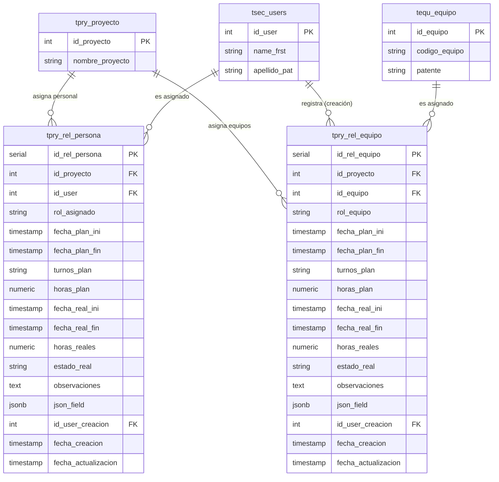

# Especificación Técnica 22: Modelamiento de Base de Datos para Asignación de Recursos (Personas y Equipos) a Proyectos

> **Estado:** ESPECIFICACIÓN APROBADA  
> **Ubicación Oficial:** `.agents/specs/22_asignacion_recursos_db_spec.md`  
> **Módulo:** Operaciones / Gestión de Proyectos (`tpry_`)  
> **Tablas Relacionadas:** `tpry_proyecto`, `tsec_users`, `tequ_equipo`, `tpry_rel_persona`, `tpry_rel_equipo`

---

## 1. Resumen Ejecutivo
Esta especificación técnica define el modelamiento de datos para la asignación de recursos (personas y equipos) a los proyectos en Grúas San Pablo (GSP) bajo la metodología **Spec-Driven** y los estándares de arquitectura de LeanGlobal.

El diseño alinea la arquitectura con el esquema real de la base de datos y la convención de nomenclatura del producto:
- **Personas:** Registradas en `tsec_users` (`id_user INT`).
- **Equipos:** Registrados en `tequ_equipo` (`id_equipo INT`).
- **Proyectos:** Registrados en `tpry_proyecto` (`id_proyecto INT`).
- **Nomenclatura Estándar de Fechas:** `fecha_plan_ini`, `fecha_plan_fin`, `fecha_real_ini`, `fecha_real_fin`.

Se definen dos nuevas tablas transaccionales: **`tpry_rel_persona`** y **`tpry_rel_equipo`**, utilizando claves foráneas tipo `INT` e identificadores subrogados `SERIAL`, asegurando la integridad referencial y el seguimiento temporal de la planificación versus la ejecución real.

---

## 2. Diagrama Entidad-Relación (ER)



---

## 3. Sentencias DDL de PostgreSQL (Oficiales)

```sql
-- ==============================================================================
-- Tabla: tpry_rel_persona (Asignación de Personal a Proyectos)
-- ==============================================================================
CREATE TABLE tpry_rel_persona (
    id_rel_persona SERIAL PRIMARY KEY,
    id_proyecto INT NOT NULL,
    id_user INT NOT NULL,
    rol_asignado VARCHAR(100),
    fecha_plan_ini TIMESTAMP WITH TIME ZONE NOT NULL,
    fecha_plan_fin TIMESTAMP WITH TIME ZONE NOT NULL,
    turnos_plan VARCHAR(100),
    horas_plan NUMERIC(8,2),
    fecha_real_ini TIMESTAMP WITH TIME ZONE,
    fecha_real_fin TIMESTAMP WITH TIME ZONE,
    horas_reales NUMERIC(8,2),
    estado_real VARCHAR(50) DEFAULT 'PROGRAMADO',
    observaciones TEXT,
    json_field JSONB DEFAULT '{}'::jsonb,
    id_user_creacion INT,
    fecha_creacion TIMESTAMP WITH TIME ZONE DEFAULT CURRENT_TIMESTAMP,
    fecha_actualizacion TIMESTAMP WITH TIME ZONE DEFAULT CURRENT_TIMESTAMP,
    
    CONSTRAINT fk_tpry_rel_persona_proyecto FOREIGN KEY (id_proyecto) REFERENCES tpry_proyecto(id_proyecto) ON DELETE CASCADE,
    CONSTRAINT fk_tpry_rel_persona_user FOREIGN KEY (id_user) REFERENCES tsec_users(id_user) ON DELETE RESTRICT,
    CONSTRAINT fk_tpry_rel_persona_creacion FOREIGN KEY (id_user_creacion) REFERENCES tsec_users(id_user) ON DELETE SET NULL,
    CONSTRAINT chk_fechas_plan_persona CHECK (fecha_plan_fin >= fecha_plan_ini),
    CONSTRAINT chk_fechas_real_persona CHECK (fecha_real_fin >= fecha_real_ini)
);

CREATE INDEX idx_tpry_rel_persona_proyecto ON tpry_rel_persona(id_proyecto);
CREATE INDEX idx_tpry_rel_persona_user ON tpry_rel_persona(id_user);
CREATE INDEX idx_tpry_rel_persona_fechas_plan ON tpry_rel_persona(fecha_plan_ini, fecha_plan_fin);

COMMENT ON TABLE tpry_rel_persona IS 'Asignación de personal (tsec_users) a proyectos con seguimiento de planificación y ejecución real.';

-- ==============================================================================
-- Tabla: tpry_rel_equipo (Asignación de Equipos a Proyectos)
-- ==============================================================================
CREATE TABLE tpry_rel_equipo (
    id_rel_equipo SERIAL PRIMARY KEY,
    id_proyecto INT NOT NULL,
    id_equipo INT NOT NULL,
    rol_equipo VARCHAR(100),
    fecha_plan_ini TIMESTAMP WITH TIME ZONE NOT NULL,
    fecha_plan_fin TIMESTAMP WITH TIME ZONE NOT NULL,
    turnos_plan VARCHAR(100),
    horas_plan NUMERIC(8,2),
    fecha_real_ini TIMESTAMP WITH TIME ZONE,
    fecha_real_fin TIMESTAMP WITH TIME ZONE,
    horas_reales NUMERIC(8,2),
    estado_real VARCHAR(50) DEFAULT 'PROGRAMADO',
    observaciones TEXT,
    json_field JSONB DEFAULT '{}'::jsonb,
    id_user_creacion INT,
    fecha_creacion TIMESTAMP WITH TIME ZONE DEFAULT CURRENT_TIMESTAMP,
    fecha_actualizacion TIMESTAMP WITH TIME ZONE DEFAULT CURRENT_TIMESTAMP,
    
    CONSTRAINT fk_tpry_rel_equipo_proyecto FOREIGN KEY (id_proyecto) REFERENCES tpry_proyecto(id_proyecto) ON DELETE CASCADE,
    CONSTRAINT fk_tpry_rel_equipo_equipo FOREIGN KEY (id_equipo) REFERENCES tequ_equipo(id_equipo) ON DELETE RESTRICT,
    CONSTRAINT fk_tpry_rel_equipo_creacion FOREIGN KEY (id_user_creacion) REFERENCES tsec_users(id_user) ON DELETE SET NULL,
    CONSTRAINT chk_fechas_plan_equipo CHECK (fecha_plan_fin >= fecha_plan_ini),
    CONSTRAINT chk_fechas_real_equipo CHECK (fecha_real_fin >= fecha_real_ini)
);

CREATE INDEX idx_tpry_rel_equipo_proyecto ON tpry_rel_equipo(id_proyecto);
CREATE INDEX idx_tpry_rel_equipo_equipo ON tpry_rel_equipo(id_equipo);
CREATE INDEX idx_tpry_rel_equipo_fechas_plan ON tpry_rel_equipo(fecha_plan_ini, fecha_plan_fin);

COMMENT ON TABLE tpry_rel_equipo IS 'Asignación de maquinarias y equipos (tequ_equipo) a proyectos con seguimiento de planificación y ejecución real.';
```

---

## 4. Consultas SQL Estándar

### 4.1 Personal Asignado a un Proyecto
```sql
SELECT 
    rp.id_rel_persona,
    p.nombre_proyecto,
    u.name_frst || ' ' || u.apellido_pat AS nombre_completo,
    rp.rol_asignado,
    rp.fecha_plan_ini,
    rp.fecha_plan_fin,
    rp.estado_real
FROM 
    tpry_rel_persona rp
INNER JOIN tpry_proyecto p ON rp.id_proyecto = p.id_proyecto
INNER JOIN tsec_users u ON rp.id_user = u.id_user
WHERE 
    rp.id_proyecto = $1
ORDER BY 
    rp.fecha_plan_ini ASC;
```

### 4.2 Equipos Asignados a un Proyecto
```sql
SELECT 
    re.id_rel_equipo,
    p.nombre_proyecto,
    e.codigo_equipo,
    e.patente,
    re.rol_equipo,
    re.fecha_plan_ini,
    re.fecha_plan_fin,
    re.estado_real
FROM 
    tpry_rel_equipo re
INNER JOIN tpry_proyecto p ON re.id_proyecto = p.id_proyecto
INNER JOIN tequ_equipo e ON re.id_equipo = e.id_equipo
WHERE 
    re.id_proyecto = $1
ORDER BY 
    re.fecha_plan_ini ASC;
```

---

## 5. Payloads JSON Estándar para API REST

### 5.1 Asignar Persona (`POST /api/proyectos/:id_proyecto/asignaciones/personas`)
```json
{
  "id_proyecto": 101,
  "id_user": 505,
  "rol_asignado": "Operador Grúa",
  "fecha_plan_ini": "2026-08-10T08:00:00-04:00",
  "fecha_plan_fin": "2026-08-20T18:00:00-04:00",
  "turnos_plan": "5x2 Dia",
  "horas_plan": 90.00,
  "estado_real": "PROGRAMADO",
  "id_user_creacion": 20,
  "observaciones": "Requiere certificación de rigger al día."
}
```

### 5.2 Asignar Equipo (`POST /api/proyectos/:id_proyecto/asignaciones/equipos`)
```json
{
  "id_proyecto": 101,
  "id_equipo": 302,
  "rol_equipo": "Grúa Principal",
  "fecha_plan_ini": "2026-08-10T08:00:00-04:00",
  "fecha_plan_fin": "2026-08-20T18:00:00-04:00",
  "turnos_plan": "Diurno",
  "horas_plan": 90.00,
  "estado_real": "PROGRAMADO",
  "id_user_creacion": 20,
  "json_field": {
    "accesorios": ["estrobos", "eslingas de 5T"]
  }
}
```
