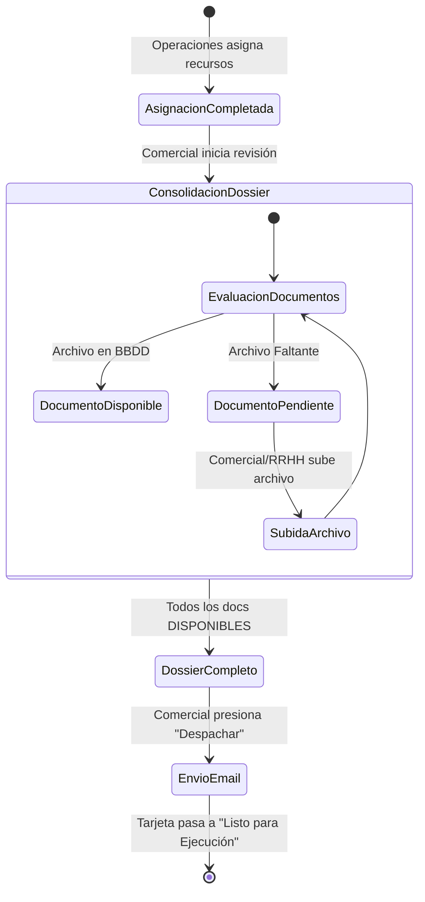

# Especificación Técnica 23: Gestión de Acreditaciones Post-Asignación (Dossier B2B)

> **Estado:** ESPECIFICACIÓN UX Y ARQUITECTURA APROBADA DEFINITIVA  
> **Ubicación Oficial:** `.agents/specs/23_acreditaciones_post_asignacion_ux_spec.md`  
> **Módulo:** CRM & Operaciones / Gestor de Oportunidades (`GestorOportunidades.vue`)  
> **Rol Principal:** Ejecutivo Comercial / Coordinador de Operaciones

---

## 1. Resumen Ejecutivo y Ubicación UI Oficial

El proceso de acreditación de personal y equipos es crítico para el inicio de las operaciones en terreno. Una vez que el departamento de Operaciones asigna los recursos físicos y humanos a un proyecto en la Pestaña C (Asignación de Recursos OT), se activa la pestaña de **Acreditaciones & Dossier (Post-Asignación)** para gestionar, verificar y despachar la documentación técnica y laboral al cliente mandante.

### Ubicación UI Oficial

*   **Pestaña Dedicada en `GestorOportunidades.vue`:**
    *   **Solapa:** `4. Acreditaciones & Dossier (Post-Asignación)`.
    *   **Disposición Visual:** **3 Columnas Paralelas Limpias (Grid CSS 3 Columnas)** para optimización espacial:
        *   **Columna 1:** 🏢 Empresa Mandante (Nómina de documentos tributarios y de SST de la empresa).
        *   **Columna 2:** 🏗️ Equipos Asignados (Nómina de documentos de las grúas y equipos de apoyo efectivamente asignados en la Pestaña C, identificados con sus patentes PPU).
        *   **Columna 3:** 👷 Personal Asignado (Nómina de documentos del personal operativo y tripulación asignada en la Pestaña C, identificada por cargo y nombre real de `tsec_users`).
    *   **Bloque Inferior:** 📜 Historial de Envíos B2B del Dossier (traza de versiones v1.0, v1.1, links directos y visor de correo HTML exacto `Ver Correo 👁️`).

---

### Reglas de Negocio Clave: Múltiples Recursos y Semáforo de Vencimiento

1. **Soporte para N Personas y M Equipos:**
   - Un proyecto o servicio puede requerir múltiples trabajadores (Operadores, Riggers, Prevencionistas, Choferes) y múltiples equipos (Grúas principales, grúas auxiliares, camiones pluma, camas bajas, camionetas).
   - En la interfaz, cada persona y cada equipo aparece agrupado en tarjetas expandibles tipo **Acordeón**, mostrando individualmente la nómina de documentos exigidos.

2. **Opción de Carga de Documentos Faltantes (In-Situ):**
   - Si un documento no existe en la base de datos, figura con estado `PENDIENTE` y despliega un botón **"Subir Archivo"** (`FileUploaderModal.vue`).
   - Permite al usuario cargar el PDF/Imagen directamente desde la pantalla. Al completar la subida, se guarda en el repositorio oficial de la BD y la fila cambia inmediatamente a `DISPONIBLE / OK`.

3. **Semáforo Estricto de Vencimiento de Documentos:**
   - 🔴 **VENCIDO (`fecha_vencimiento < HOY`):**
     - **Badge:** `VENCIDO (Expira DD/MM/YYYY)` en fondo rojo.
     - **Regla:** **BLOQUEA EL DESPACHO DEL DOSSIER**. No se permite despachar la acreditación si al menos 1 documento está vencido. Se exige al comercial subir una renovación vigente.
   - 🟡 **POR VENCER (`fecha_vencimiento <= HOY + 30 días`):**
     - **Badge:** `POR VENCER (X días)` en fondo amarillo/ámbar.
     - **Regla:** Permite el despacho pero muestra una alerta preventiva y resalta el aviso en el correo B2B enviado al cliente.
   - 🟢 **VIGENTE (`fecha_vencimiento > HOY + 30 días`):**
     - **Badge:** `VIGENTE / OK` en fondo verde esmeralda.

4. **Re-Envío Adicional y Trazabilidad Indeleble:**
   - **Permite Re-envíos Post-Acreditación:** Si con posterioridad el comercial debe incorporar un documento adicional o reemplazar un certificado renovado, puede abrir el panel en cualquier momento, subir el archivo y presionar **"Volver a Despachar Dossier (v1.1)"**.
   - **Historial de Despachos en UI con Links Directos:** El panel incluye la sección **"📜 Historial de Envíos del Dossier"** que registra:
     - *Fecha y Hora Exacta* (timestamp ISO).
     - *Usuario Ejecutor* (quién despachó).
     - *Destinatarios y Copias* (correos a los que llegó).
     - *Links Directos a Documentos Enviados:* Lista JSON interactiva con los nombres y URLs directas (`/api/archivo/ver/:id_doc`) de cada archivo despachado en esa versión específica.
   - **Visor de Correo HTML Enviado (`Ver Correo 👁️`):** Cada registro de envío contiene el botón "Ver Correo", que consulta la tabla `tnot_queue` por `id_notificacion` y despliega en un modal emergente la copia fiel del HTML exacto que recibió el cliente.

---

## 2. User Journey & Diagrama de Estados

### User Journey (Comercial)
1. **Notificación/Filtro:** El comercial recibe una alerta o filtra el Kanban por tarjetas en estado "Esperando Acreditación".
2. **Revisión de Estado:** Abre el panel lateral del proyecto. Visualiza la lista de documentos requeridos por cada uno de los **N trabajadores** y **M equipos** asignados.
3. **Validación:** El sistema evalúa vigencias: muestra qué documentos están `VIGENTES` (verde), `POR VENCER` (amarillo), `VENCIDOS` (rojo) o `PENDIENTES` (gris).
4. **Acción:** Sube los documentos faltantes o renueva los vencidos directamente en la interfaz mediante el botón `Subir / Renovar`.
5. **Despacho:** Una vez que NO existen documentos `VENCIDOS` ni `PENDIENTES`, presiona "Despachar Dossier al Cliente".
6. **Cierre:** La tarjeta avanza automáticamente a "Acreditado / Listo para Ejecución".

### Diagrama de Estados (Mermaid)



---

## 3. Mockup Visual (Wireframe ASCII & Tailwind CSS)

### Wireframe ASCII (Panel Lateral de Acreditación)

```text
+---------------------------------------------------------+
| [X] Cerrar                                              |
|                                                         |
|  Gestión de Dossier de Acreditación                     |
|  Proyecto: #OP-2034 - Mantención Grúa 50T               |
|  Cliente: Minera Los Pelambres                          |
|---------------------------------------------------------|
|  Resumen: 8/10 Documentos Disponibles                   |
|  [||||||||||||||||||||||||||||||||--------] 80%         |
|---------------------------------------------------------|
|  PERSONAL ASIGNADO                                      |
|  [Juan Pérez - Operador]                                |
|   - Examen de Altura       [DISPONIBLE] [Ver]           |
|   - Licencia Clase D       [PENDIENTE ] [Subir]         |
|                                                         |
|  EQUIPOS ASIGNADOS                                      |
|  [Grúa Terex RT100 - PPU: ABCD-12]                      |
|   - Revisión Técnica       [DISPONIBLE] [Ver]           |
|   - Seguros                [DISPONIBLE] [Ver]           |
|   - Cert. Carga            [PENDIENTE ] [Subir]         |
|                                                         |
|  EMPRESA                                                |
|   - Cert. Laboral (F30)    [DISPONIBLE] [Ver]           |
|---------------------------------------------------------|
|                                                         |
|  [ DESPACHAR DOSSIER AL CLIENTE ] (Deshabilitado)       |
+---------------------------------------------------------+
```

---

## 4. Maquetación del Correo HTML B2B Enriquecido

```html
<!DOCTYPE html>
<html>
<head>
<style>
  body { font-family: 'Segoe UI', Tahoma, Geneva, Verdana, sans-serif; background-color: #f4f4f5; margin: 0; padding: 20px; color: #333; }
  .container { max-width: 600px; margin: 0 auto; background-color: #ffffff; border-radius: 8px; overflow: hidden; box-shadow: 0 4px 6px rgba(0,0,0,0.05); }
  .header { background-color: #0f172a; padding: 24px; text-align: center; color: white; border-bottom: 4px solid #10b981; }
  .content { padding: 32px; }
  .h1 { margin-top: 0; font-size: 20px; color: #1e293b; }
  .table { width: 100%; border-collapse: collapse; margin-top: 20px; margin-bottom: 30px; }
  .table th { background-color: #f8fafc; padding: 12px; text-align: left; font-size: 13px; color: #64748b; border-bottom: 2px solid #e2e8f0; }
  .table td { padding: 12px; border-bottom: 1px solid #e2e8f0; font-size: 14px; vertical-align: middle; }
  .btn-download { display: inline-block; padding: 6px 12px; background-color: #f1f5f9; color: #0369a1; text-decoration: none; border-radius: 4px; font-size: 12px; font-weight: 600; }
  .btn-download:hover { background-color: #e0f2fe; }
  .btn-primary { display: block; width: 100%; text-align: center; padding: 14px; background-color: #10b981; color: white; text-decoration: none; border-radius: 6px; font-weight: bold; margin-top: 20px; }
  .footer { background-color: #f8fafc; padding: 20px; text-align: center; font-size: 12px; color: #94a3b8; }
</style>
</head>
<body>
  <div class="container">
    <div class="header">
      
      <h2 style="margin: 0; font-weight: 400; font-size: 18px;">Dossier de Acreditación de Recursos</h2>
    </div>
    <div class="content">
      <h1 class="h1">Estimados [Nombre Cliente],</h1>
      <p>Adjuntamos el detalle del personal y equipos acreditados para el inicio de las operaciones correspondientes al proyecto <strong>#OP-2034 - Mantención Grúa 50T</strong>.</p>
      
      <table class="table">
        <thead>
          <tr>
            <th>RECURSO</th>
            <th>DOCUMENTO</th>
            <th>ACCESO</th>
          </tr>
        </thead>
        <tbody>
          <tr>
            <td><strong>Empresa</strong></td>
            <td>Certificado F30</td>
            <td><a href="#" class="btn-download">Ver Documento</a></td>
          </tr>
          <tr>
            <td><strong>Juan Pérez</strong><br><span style="font-size:12px;color:#64748b;">Operador</span></td>
            <td>Examen de Altura Física</td>
            <td><a href="#" class="btn-download">Ver Documento</a></td>
          </tr>
          <tr>
            <td><strong>Grúa RT100</strong><br><span style="font-size:12px;color:#64748b;">ABCD-12</span></td>
            <td>Revisión Técnica</td>
            <td><a href="#" class="btn-download">Ver Documento</a></td>
          </tr>
        </tbody>
      </table>

      <a href="#" class="btn-primary">Descargar Dossier Completo (ZIP)</a>
    </div>
    <div class="footer">
      <p>Este es un correo automático corporativo de la plataforma LeanGlobal / Grúas San Pablo.</p>
      <p>&copy; 2026 Grúas San Pablo. Todos los derechos reservados.</p>
    </div>
  </div>
</body>
</html>
```

---

## 5. Arquitectura de Componentes Vue 3 y API Contracts

### Árbol de Componentes Vue 3
Dentro de `src/views/Operaciones/Torre.vue`:

```text
Torre.vue
 └── KanbanBoard.vue
      └── KanbanColumn.vue (En Preparación / Acreditaciones)
           └── KanbanCard.vue
                └── (onClick) -> DossierDrawer.vue
                      ├── DossierHeader.vue
                      ├── DossierProgress.vue
                      ├── ResourceSection.vue (Empresa, Personas, Equipos)
                      │    └── DocumentRow.vue (Ver / Subir)
                      │         └── FileUploaderModal.vue
                      └── DossierFooterActions.vue
```

### API Contracts
- `GET /api/proyectos/:id/dossier`
- `POST /api/proyectos/:id/dossier/documento`
- `POST /api/proyectos/:id/dossier/enviar`
