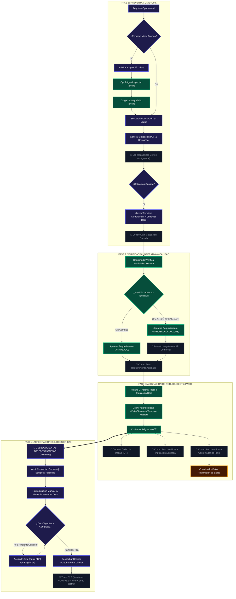

# Especificación Técnica 24: Flujo Operativo E2E, Notificaciones, OT & Acreditaciones B2B

> **Estado:** ESPECIFICACIÓN OFICIAL APROBADA  
> **Ubicación Oficial:** `.agents/specs/24_flujo_operativo_ot_acreditaciones_spec.md`  
> **Módulo:** CRM, Operaciones & Dossier (`GestorOportunidades.vue`, `Torre.vue`)  
> **Empresa:** Grúas San Pablo (GSP) / LeanGlobal

---

## 📊 Diagrama de Flujo del Proceso (E2E)

---

## 📋 Detalle Específico de Reglas y Comportamiento por Fase

### 1. FASE 1: PREVENTA COMERCIAL
- **Visita a Terreno:** El Ejecutivo Comercial solicita asignación de inspección. El Coordinador de Operaciones designa un especialista/inspector quien acude a terreno y registra el levantamiento (geolocalización, capacidades, aparejos requeridos).
- **Despacho B2B de Cotización:** Se emite la cotización formal PDF y se notifica vía correo HTML corporativo dejando registro indeleble en `tnot_queue`.
- **Gatillo de Acreditación:** Al ganar la cotización, el comercial activa la casilla *"Requiere Acreditación"* y selecciona la lista de documentos exigidos por el cliente (Empresa, Equipos, Personas). Se envía correo automático notificando el hito de cotización ganada.

### 2. FASE 2: VERIFICACIÓN OPERATIVA & AUDITORÍA KPI COMERCIAL
- **Verificación Técnica:** Operaciones revisa la propuesta comercial contra la capacidad de flota real.
- **Aprobación & Métrica KPI:**
  - Si aprueba sin cambios ➔ `APROBADO`.
  - Si debe corregir flota o tiempos ➔ `APROBADO_CON_OBS` (Aprobado con observaciones). Este estado computa una **penalización negativa en el KPI del Comercial** por cotización defectuosa.
- **Notificación:** Se despacha un correo de notificación automática informando el paso a la fase de asignación.

### 3. FASE 3: ASIGNACIÓN DE RECURSOS OT & PATIO
- **Invariante Visual:** El Estructurador de Servicios en la Pestaña C mantiene **EXACTAMENTE LA MISMA ESTRUCTURA DE TABLA POR CATEGORÍAS** que en las fases anteriores.
- **Asignación & Ampliación:** Cada línea cotizada/aprobada incluye selectores de Equipo Principal y Tripulación. Permite incorporar equipos de apoyo adicionales (camiones pluma, camas bajas, escoltas) y tripulantes extra sin desarmar la matriz original.
- **Aparejos de Izaje Master:** Muestra la totalidad de aparejos existentes (Cadenas, Estrobos, Pulpos, Grilletes, Balancines, Eslingas, Canastillos). Si vienen de la Visita a Terreno se precargan; si viene en `0` o no hubo visita a terreno, se exponen todos desde el **Template Estándar de Aparejos** para que Operaciones defina cantidades/capacidades.
- **Confirmación OT & Notificaciones:** Al confirmar la asignación:
  1. Se genera la Orden de Trabajo (OT).
  2. Correo automático a **cada integrante de la tripulación**.
  3. Correo automático al **Coordinador de Patio** (fase Preparación de Salida).
  4. **Se DESBLOQUEA el Tab de Acreditaciones**.

### 4. FASE 4: ACREDITACIONES & DOSSIER B2B
- **Habilitación Condicionada:** El Tab de Acreditaciones **permanece bloqueado** hasta que Operaciones confirma la asignación.
- **Homologación Manual ("A Mano"):** Permite asociar "a mano" el nombre de documento exigido por el cliente mandante con el archivo real guardado en la base de datos de SST/Flota/Personal.
- **UI en 3 Columnas:** Disposición espacial en 3 columnas paralelas limpias (**1. Empresa Mandante**, **2. Equipos Asignados**, **3. Personal Asignado**), con acciones in-situ (`[Subir PDF]`, `[+ Exigir Doc]`, `[×]`).
- **Semáforo & Traza B2B:** Certificados `< 30 días` alertan; certificados `VENCIDOS` o `PENDIENTES` bloquean el despacho. Al despachar se envía el correo B2B al cliente y se registra la traza de versiones (v1.0, v1.1) con visor de correo HTML exacto (`Ver Correo 👁️`).

---

## 🛠️ Archivos de Implementación
- **Especificación:** `.agents/specs/24_flujo_operativo_ot_acreditaciones_spec.md`
- **Frontend CRM:** `ejecucion/frontend/src/views/CRM/GestorOportunidades.vue`
- **Frontend Torre:** `ejecucion/frontend/src/views/Torre.vue`
