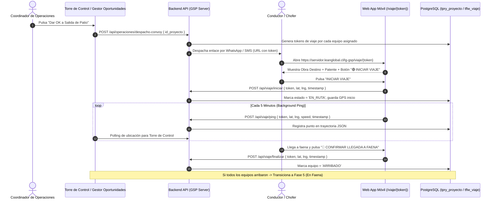

# 📐 Especificación Técnica: Módulo de Desplazamiento y Monitoreo de Convoy con Token Web

**Documento:** `30_desplazamiento_monitoreo_convoy_token_spec.md`  
**Ecosistema:** Grúas San Pablo (GSP) / LeanGlobal Platform  
**Fase de Dominio:** Fase 4 - Desplazamiento & Ruta (`tpry_proyecto.id_proyecto_estado = 6` / En Tránsito)  
**Autor:** Sergio Gajardo / Antigravity AI  
**Fecha:** 19 de Agosto de 2026  
**Estado:** `ESPECIFICACIÓN FORMAL APROBADA`  

---

## 1. 📌 Resumen Ejecutivo y Propósito

El presente documento establece la arquitectura técnica, modelo de datos, flujo de interacción móvil y mecanismos de telemetría para la etapa de **Desplazamiento y Monitoreo de Flota** posterior a la autorización de salida de patio (`Dar OK a Salida`).

### 🎯 Objetivos Clave:
1. **Monitoreo Integral por Equipo:** Rastrear de forma individual cada vehículo del convoy (Grúa Principal, Camiones Cama Baja con contrapesos, Camionetas Escolta/Guía).
2. **Cero Fricción para el Conductor (Token Web Persistente):** Eliminar la barrera de login/password para los choferes mediante una Web App ultraligera despachada vía WhatsApp / SMS / Email con token criptográfico único.
3. **Telemetría Determinista:** Captura automática de coordenadas GPS (`lat`, `lng`, `speed`, `timestamp`) en 3 hitos:
   * **Inicio de Viaje:** Al salir del patio.
   * **Pings Periódicos en Ruta:** Cada 5 minutos en segundo plano.
   * **Llegada a Faena:** Al arribar a la geocerca de la obra del cliente.
4. **Visibilidad en Torre de Control:** Telemetría consolidada en tiempo real sobre mapa interactivo en la consola web de operaciones.

---

## 2. 🗺️ Diagrama del Flujo Operativo



---

## 3. 💾 Modelo de Datos y Estructura JSON

### 3.1. Estructura del Token en `json_field.ejecucion_v1.desplazamiento`

```json
{
  "desplazamiento": {
    "convoy_iniciado": true,
    "fecha_hora_despacho": "2026-08-19T08:30:00.000Z",
    "usuario_despacho_id": 37,
    "viajes_equipos": {
      "90": {
        "id_equipo": 90,
        "patente": "RSPP.56-7",
        "tipo_equipo": "GRUAS TELESCOPICAS",
        "modelo": "MAXUS T60 SC 4X2 DX",
        "chofer_nombre": "Carlos Mendoza",
        "chofer_telefono": "+56987654321",
        "token_viaje": "vj_8f9a2b3c4d5e6f7a8b9c0d1e",
        "estado_viaje": "EN_RUTA",
        "timestamp_inicio": "2026-08-19T08:35:12.000Z",
        "gps_inicio": { "lat": -36.6172, "lng": -72.1148 },
        "timestamp_llegada": null,
        "gps_llegada": null,
        "ultimo_ping": {
          "lat": -36.6340,
          "lng": -72.1020,
          "velocidad_kmh": 65.4,
          "timestamp": "2026-08-19T08:50:00.000Z"
        },
        "trayectoria_gps": [
          { "lat": -36.6172, "lng": -72.1148, "t": "2026-08-19T08:35:12Z" },
          { "lat": -36.6250, "lng": -72.1080, "t": "2026-08-19T08:40:00Z" },
          { "lat": -36.6300, "lng": -72.1050, "t": "2026-08-19T08:45:00Z" },
          { "lat": -36.6340, "lng": -72.1020, "t": "2026-08-19T08:50:00Z" }
        ],
        "incidencias": []
      },
      "92": {
        "id_equipo": 92,
        "patente": "SDXD93-2",
        "tipo_equipo": "VEHICULOS LIVIANOS",
        "modelo": "GREAT WALL POER PLUS",
        "chofer_nombre": "Juan Pérez",
        "chofer_telefono": "+56912345678",
        "token_viaje": "vj_1a2b3c4d5e6f7a8b9c0d1e2f",
        "estado_viaje": "ASIGNADO",
        "timestamp_inicio": null,
        "gps_inicio": null,
        "timestamp_llegada": null,
        "gps_llegada": null,
        "trayectoria_gps": [],
        "incidencias": []
      }
    }
  }
}
```

---

## 4. 📱 Especificación de la Web App Móvil del Conductor (`/viaje/:token`)

### 4.1. Principios de Interfaz Móvil:
1. **Sin Login ni Credenciales:** Autenticación por token URL validado contra el backend.
2. **Alta Legibilidad & Contraste:** Botones táctiles de gran tamaño (`min-h-[56px]`), tipografía nítida para uso a plena luz del sol.
3. **Persistencia Local:** Si el navegador se cierra o el móvil pierde cobertura, el estado y los pings pendientes se guardan en `localStorage` / `IndexedDB` y se sincronizan al recuperar señal.

### 4.2. Estados de la Pantalla del Móvil:

#### Estado A: Listo para Salir (`estado_viaje = 'ASIGNADO'`)
* **Tarjeta del Servicio:**
  * Patente: `🚜 RSPP.56-7 - MAXUS T60 SC 4X2 DX`
  * Obra Destino: `Obra Test, Chillán`
  * Mandante: `LeanGlobal Spa`
* **Botón Principal:**
  * `🟢 INICIAR VIAJE (SALIDA DE PATIO)`
  * *Acción:* Solicita permiso GPS, captura `lat/lng` y arranca el timer de telemetría.

#### Estado B: En Ruta (`estado_viaje = 'EN_RUTA'`)
* **Indicador en Vivo:**
  * `🛰️ En Trayecto hacia la Obra`
  * *Último reporte:* `Hace 2 min (GPS Activo 🟢)`
* **Botón Secundario de Emergencia:**
  * `⚠️ Reportar Detención / Incidencia` *(Abre selector rápido: Pana Mecánica / Control Policial / Tráfico)*.
* **Botón Principal de Cierre:**
  * `🏁 CONFIRMAR LLEGADA A FAENA`
  * *Acción:* Valida proximidad geográfica (opcional geocerca) y registra timestamp final.

#### Estado C: Viaje Completado (`estado_viaje = 'ARRIBADO'`)
* **Pantalla de Éxito:**
  * `✅ ¡Llegada a Faena Confirmada!`
  * Duración total del viaje: `1 hr 25 min`
  * *Mensaje:* "El equipo está listo para iniciar la etapa de faena y montaje."

---

## 5. 🔌 Endpoints REST del Backend

### 1. `GET /api/viaje/consultar/:token`
* **Acceso:** Público (validación de token).
* **Respuesta:**
  ```json
  {
    "ok": true,
    "data": {
      "id_proyecto": 66,
      "codigo_proyecto": "GSP-2608-4851-034",
      "obra_nombre": "Obra test",
      "obra_direccion": "Calle 2, Chillán",
      "obra_lat": -36.6172,
      "obra_lng": -72.1148,
      "equipo": {
        "patente": "RSPP.56-7",
        "descripcion": "MAXUS T60 SC 4X2 DX",
        "tipo": "GRUAS TELESCOPICAS"
      },
      "estado_viaje": "ASIGNADO",
      "timestamp_inicio": null
    }
  }
  ```

### 2. `POST /api/viaje/iniciar`
* **Payload:** `{ "token": "vj_xxx", "lat": -36.6172, "lng": -72.1148, "timestamp": "2026-08-19T08:35:12Z" }`
* **Efecto:** Actualiza estado a `EN_RUTA` en PostgreSQL y emite evento a la Torre de Control.

### 3. `POST /api/viaje/ping`
* **Payload:** `{ "token": "vj_xxx", "lat": -36.6340, "lng": -72.1020, "speed": 65.4, "timestamp": "2026-08-19T08:50:00Z" }`
* **Efecto:** Agrega punto a `trayectoria_gps` y actualiza `ultimo_ping`.

### 4. `POST /api/viaje/finalizar`
* **Payload:** `{ "token": "vj_xxx", "lat": -36.6172, "lng": -72.1148, "timestamp": "2026-08-19T10:00:15Z" }`
* **Efecto:** Actualiza estado a `ARRIBADO`. Si todos los equipos asignados al proyecto tienen estado `ARRIBADO`, actualiza `id_proyecto_estado = 7` (En Faena).

---

## 6. 🖥️ Visualización en Torre de Control (Consola Web)

En la columna **En Preparación Operaciones / Desplazamiento**:
1. **Ficha de Seguimiento de Convoy:**
   * Muestra el listado de patentes y su estado:
     * `🚜 RSPP.56-7`: `🛰️ En Ruta (65 km/h)`
     * `🚛 SDXD93-2`: `🏁 Arribado (09:45 hrs)`
2. **Mini-Mapa de Monitoreo:**
   * Marcadores en vivo con el icono de grúa y camioneta sobre el mapa Mapbox/Leaflet mostrando la ruta desde el patio San Pablo hasta la obra.

---

## 7. 🛡️ Matriz de Pruebas & Criterios de Aceptación

| ID | Escenario | Criterio de Aceptación |
| :--- | :--- | :--- |
| **CA-01** | Apertura de Enlace por Chofer | El conductor abre el enlace en Chrome/Safari móvil sin solicitar usuario ni contraseña. |
| **CA-02** | Inicio de Desplazamiento | Al pulsar "Iniciar Viaje", se captura la geolocalización GPS real del móvil y el estado cambia a `EN_RUTA`. |
| **CA-03** | Ping Periódico cada 5 min | El navegador transmite `lat/lng` cada 5 minutos actualizando la posición en la Torre de Control. |
| **CA-04** | Llegada de Todo el Convoy | Cuando el último vehículo marca "Llegada a Faena", el proyecto transiciona automáticamente a `Fase 5: En Faena`. |

---
*Fin de la Especificación `30_desplazamiento_monitoreo_convoy_token_spec.md`.*
