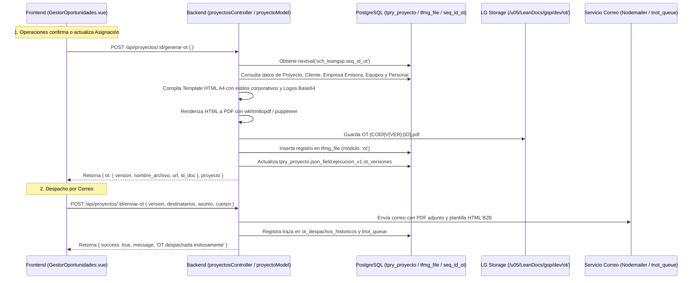

# 📋 Especificación Técnica Spec-Driven: Generación de PDF de Orden de Trabajo (OT), Versionamiento y Despacho B2B (Spec 33)

**Código:** `SPEC-GSP-33`  
**Módulo:** Operaciones & Torre de Control (Gestor de Oportunidades - Pestaña C)  
**Versión:** 1.0.0  
**Fecha:** 2026-08-24  
**Estado:** APROBADO PARA IMPLEMENTACIÓN  

---

## 1. 🎯 Objetivos y Alcance

1. **Generación Automatizada de PDF de Orden de Trabajo (OT):** Renderizado en el backend de un documento PDF oficial A4 de alta definición que consolida toda la información técnica, física y humana del servicio de izaje/transporte.
2. **Versionamiento Inmutable (`V1`, `V2`, `V3`...):** Cada vez que Operaciones modifique la asignación y genere una nueva OT, el sistema incrementa la versión con la secuencia `sch_leangsp.seq_id_ot`, archivando las versiones previas de forma inmutable en `json_field.ejecucion_v1.ot_versiones` y en la tabla `tfmg_file`.
3. **Panel de Control de Versiones en Frontend:** Panel reactivo en la Pestaña C de Asignación de Recursos con historial de versiones, visor instantáneo de PDF y botón de despacho por correo.
4. **Despacho B2B con Trazabilidad:** Envío formal por Nodemailer con plantilla HTML ejecutiva, adjuntando el PDF de la OT o inyectando link de descarga directa para Comercial, Operaciones, Patio, Tripulación y Mandante.

---

## 2. 🏛️ Arquitectura y Flujo de Datos



---

## 3. 📄 Estructura del Documento PDF de la OT (Layout A4)

El documento PDF de la OT contendrá las siguientes secciones estructuradas:

1. **Cabecera Oficial:**
   * Logo corporativo de la empresa emisora (Grúas San Pablo / Royal Rental / Transportes San Pablo) en Base64.
   * Razón Social, RUT, Giro, Dirección Casa Matriz y Teléfono.
   * Título destacado: **ORDEN DE TRABAJO OPERACIONAL (OT)**.
   * Código Maestro: `OT-[CODIGO_PROYECTO]-V[VERSION]`.
   * Fecha y Hora de Emisión del Documento.

2. **Datos del Mandante & Faena:**
   * Razón Social del Cliente Mandante, RUT y Giro.
   * Nombre del Contacto en Terreno y Teléfono.
   * Nombre de la Faena / Obra, Dirección y Comuna.
   * Coordenadas GPS Satelitales (Latitud / Longitud).

3. **Cronograma Operativo:**
   * Salida Programada de Patio (Fecha y Hora).
   * Llegada e Inicio Estimado en Faena (Fecha y Hora).
   * Término Estimado de Faena y Retorno a Base (Fecha y Hora).

4. **Flota & Convoy Asignado (Equipos):**
   * Grúa Principal (Marca, Modelo, Tonelaje, Patente).
   * Camión Pluma / Auxiliar (si aplica).
   * Equipos de Traslado (Camas Bajas, Semirremolques, Escoltas).
   * Operador / Conductor asignado a cada máquina.

5. **Dotación Humana & Tripulación de Faena:**
   * Operador de Grúa Principal (Nombre, RUT, Rol).
   * Rigger Certificado (Nombre, RUT, N° Registro / Credencial).
   * Choferes de Cama Baja y Transporte (Nombre, RUT).
   * Prevencionista de Riesgos / Supervisor (si aplica).

6. **Matriz de Aparejos & Elementos de Izaje:**
   * Detalle de eslingas de cable de acero y poliéster con capacidad en toneladas.
   * Grilletes, estrobos, fajas, cadenas y balancines asignados.

7. **Condiciones Operativas & Logística:**
   * Responsabilidad de Combustible (Cliente vs Grúas San Pablo).
   * Régimen de Viáticos, Alojamiento y Alimentación.
   * Observaciones e Instrucciones Técnicas de Izaje.

8. **Cuadro de Firmas:**
   * Despachador / Coordinador de Operaciones (Firma y Timbre).
   * Recepción Conforme en Faena / Supervisor Mandante (Firma, Nombre y RUT).

---

## 4. 🗄️ Modelo de Datos y Persistencia

### Estructura en `json_field.ejecucion_v1`
```json
{
  "asignacion_confirmada": true,
  "ot_versiones": [
    {
      "id_ot": 105,
      "version": 1,
      "nombre_archivo": "OT-GSP-2608-4851-039V1-105.pdf",
      "fecha": "2026-08-24T14:00:00.000Z",
      "url": "/v1/storage/view/1270",
      "id_doc": 1270,
      "generado_por": "Sergio Gajardo",
      "total_equipos": 2,
      "total_tripulacion": 3
    }
  ],
  "ot_despachos_historicos": [
    {
      "version": 1,
      "fecha": "2026-08-24T14:05:00.000Z",
      "destinatarios": ["operaciones@arriendosanpablo.cl", "patio@leanglobal.cl", "mandante@cliente.cl"],
      "enviado_por": "Sergio Gajardo"
    }
  ]
}
```

---

## 5. 🔌 Endpoints Backend (REST API)

### 1. `POST /api/proyectos/:id/generar-ot`
* **Descripción:** Genera el PDF de la OT con los datos actuales de la asignación y registra la nueva versión.
* **Payload:** `{ omitir_firma_fes: true }`
* **Respuesta 200 OK:**
```json
{
  "message": "Versión de Orden de Trabajo generada exitosamente",
  "ot": {
    "id_ot": 105,
    "version": 1,
    "nombre_archivo": "OT-GSP-2608-4851-039V1-105.pdf",
    "url": "/v1/storage/view/1270",
    "id_doc": 1270,
    "fecha": "2026-08-24T14:00:00.000Z"
  },
  "proyecto": { "id_proyecto": 71, "json_field": { ... } }
}
```

### 2. `POST /api/proyectos/:id/enviar-ot`
* **Descripción:** Despacha la OT generada por correo con plantilla HTML corporativa.
* **Payload:**
```json
{
  "version": 1,
  "destinatarios": ["coordinador@arriendosanpablo.cl", "patio@leanglobal.cl"],
  "asunto": "🏗️ Orden de Trabajo OT-GSP-2608-4851-039V1 - Servicio de Izaje",
  "cuerpo_adicional": "Adjuntamos la Orden de Trabajo oficial para la preparación de patio y salida de convoy."
}
```
* **Respuesta 200 OK:** `{ "success": true, "message": "Orden de Trabajo despachada exitosamente" }`
