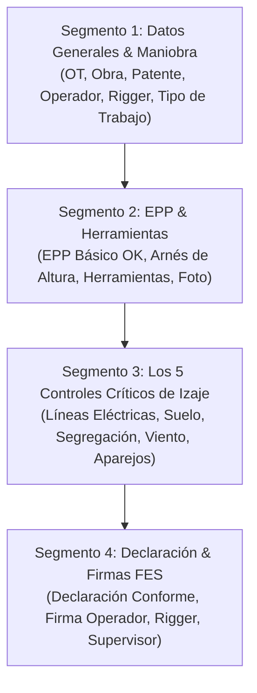

# 📋 Especificación Técnica N° 36: Template Dinámico "AST Simple (1 Usuario / Dupla)" (GSP)

> **Estado:** ESPECIFICACIÓN TÉCNICA OFICIAL Y DISEÑO DE ARQUITECTURA  
> **Proyecto:** Grúas San Pablo (GSP) / Ecosistema LeanGlobal  
> **Ubicación:** `.agents/specs/36_ast_simple_usuario_spec.md`  
> **Código del Template:** `TMPL-GSP-AST-SIMPLE`  
> **Nombre:** Análisis Seguro de Trabajo (AST / ART Simple)  
> **Id Empresa:** 9 (Grúas San Pablo)  
> **Id Flujo (`id_flow_tmpl`):** 1 (FES_DIRECTA)  
> **Ámbito:** PWA Operador / Terreno ➔ Evaluación Pre-Operacional en 60 Segundos ➔ 5 Controles Críticos de Izaje ➔ Firma FES ➔ PDF Certificado  

---

## 🎯 1. Propósito y Filosofía Operacional

El **AST Simple** reemplaza el formato de papel tradicional de 3 páginas y 10 trabajadores por un flujo ultraligero de **45 a 60 segundos** en la PWA móvil, diseñado específicamente para la realidad de **1 Operador (o dupla Operador + Rigger)** en faenas de izaje:

1. **Cero Fricción de Digitado:** Precarga automática de Proyecto, OT, Obra, Patente y Nombres de tripulación.
2. **EPP en 1 Toque:** Verificación global del equipo de protección obligatorio con soporte de arnés condicional.
3. **Foco en los 5 Riesgos Fatales de Izaje:** Verificación determinística de tendido eléctrico, estabilidad de suelo, segregación peatonal, viento y aparejos.
4. **Respaldo Legal Inmediato:** Firma digital (Canvas o PIN OTP) con geolocalización GPS, timestamp y generación automática de PDF oficial.

---

## 🧱 2. Estructura de Segmentos y Atributos



---

## 📄 3. Estructura JSON Canónica del Template (`tsrv_templates.json_template`)

```json
{
  "code": "TMPL-GSP-AST-SIMPLE",
  "title": "ANÁLISIS SEGURO DE TRABAJO (AST / ART SIMPLE)",
  "description": "Evaluación pre-operacional rápida de riesgos de izaje para 1 operador o dupla operativa",
  "version": "1.0",
  "segments": [
    {
      "title": "1. DATOS GENERALES Y TAREA A EJECUTAR",
      "posicion": 1,
      "collapsible": false,
      "attributes": [
        {
          "name": "num_ot",
          "label": "Código del Proyecto / N° OT",
          "type": "textField",
          "required": true
        },
        {
          "name": "fecha_ast",
          "label": "Fecha de Evaluación",
          "type": "datePicker",
          "required": true
        },
        {
          "name": "nombre_faena",
          "label": "Nombre de Faena / Obra",
          "type": "textField",
          "required": true
        },
        {
          "name": "placa_patente",
          "label": "Patente del Equipo / Grúa",
          "type": "textField",
          "required": true
        },
        {
          "name": "nombre_operador",
          "label": "Nombre del Operador",
          "type": "textField",
          "required": true
        },
        {
          "name": "nombre_rigger",
          "label": "Nombre del Rigger / Ayudante",
          "type": "textField",
          "required": false
        },
        {
          "name": "tipo_trabajo",
          "label": "Tipo de Maniobra / Trabajo a Realizar",
          "type": "comboBox",
          "default": "",
          "required": true,
          "values": {
            "quest": "Tipo de Maniobra a Realizar",
            "selected": "",
            "options": [
              { "id": "IZAJE_GRUA", "label": "Izaje con Grúa Móvil", "value": "Izaje con Grúa Móvil" },
              { "id": "CAMION_PLUMA", "label": "Carga y Descarga Camión Pluma", "value": "Carga y Descarga Camión Pluma" },
              { "id": "MANIOBRA_CRITICA", "label": "Montaje / Maniobra Crítica", "value": "Montaje / Maniobra Crítica" },
              { "id": "TRASLADO_FLOTA", "label": "Traslado / Desplazamiento en Ruta", "value": "Traslado / Desplazamiento en Ruta" },
              { "id": "OTRO", "label": "Otro Trabajo Operativo", "value": "Otro Trabajo Operativo" }
            ]
          }
        }
      ]
    },
    {
      "title": "2. ELEMENTOS DE PROTECCIÓN PERSONAL (EPP) & HERRAMIENTAS",
      "posicion": 2,
      "collapsible": false,
      "attributes": [
        {
          "name": "epp_basico_completo",
          "label": "¿Cuentas con tu EPP básico completo y en buen estado? (Casco con barbiquejo, lentes UV, zapatos de seguridad, chaleco reflectante y guantes)",
          "type": "comboBox",
          "default": "SI",
          "required": true,
          "values": {
            "quest": "EPP Básico Completo",
            "selected": "SI",
            "options": [
              { "id": "SI", "label": "SÍ - EPP Completo y Conforme", "value": "SI" },
              { "id": "NO", "label": "NO - EPP Incompleto / No Operar", "value": "NO" }
            ]
          }
        },
        {
          "name": "requiere_arnes",
          "label": "¿La maniobra requiere trabajo en altura / uso de arnés de seguridad?",
          "type": "comboBox",
          "default": "NO",
          "required": true,
          "values": {
            "quest": "Uso de Arnés de Seguridad",
            "selected": "NO",
            "options": [
              { "id": "NO", "label": "NO - Trabajo a nivel de piso", "value": "NO" },
              { "id": "SI_OK", "label": "SÍ - Arnés inspeccionado con doble cabo de vida", "value": "SI_OK" },
              { "id": "SI_NO_DISP", "label": "SÍ - No disponible / Pausa operativa", "value": "SI_NO_DISP" }
            ]
          }
        },
        {
          "name": "herramientas_estado",
          "label": "Estado de herramientas y accesorios de apoyo",
          "type": "comboBox",
          "default": "SI",
          "required": true,
          "values": {
            "quest": "Herramientas de Apoyo Conformes",
            "selected": "SI",
            "options": [
              { "id": "SI", "label": "Inspeccionadas y en Buen Estado", "value": "SI" },
              { "id": "NO", "label": "Con Desperfectos / No Utilizar", "value": "NO" },
              { "id": "NA", "label": "No Aplica", "value": "NA" }
            ]
          }
        },
        {
          "name": "foto_epp_entorno",
          "label": "Fotografía de Evidencia (EPP / Entorno de Faena)",
          "type": "photoCapture",
          "required": false
        }
      ]
    },
    {
      "title": "3. LOS 5 CONTROLES CRÍTICOS DE IZAJE (VERIFICACIÓN EN TERRENO)",
      "posicion": 3,
      "collapsible": false,
      "attributes": [
        {
          "name": "control_lineas_electricas",
          "label": "1. ⚡ Distancia a Líneas Eléctricas: ¿Se mantiene distancia de seguridad (≥ 5 metros) o línea desenergizada?",
          "type": "photoCheck",
          "default": "",
          "hasCantidad": false,
          "hasVencimiento": false,
          "galeria": [],
          "obs": "",
          "options": [
            { "id": "SI", "label": "SI" },
            { "id": "NO", "label": "NO" },
            { "id": "NA", "label": "N/A" }
          ],
          "compression": 10
        },
        {
          "name": "control_estabilidad_suelo",
          "label": "2. 🚜 Suelo y Estabilizadores: ¿Terreno firme/compactado, nivelado y almohadillas instaladas en gatos?",
          "type": "photoCheck",
          "default": "",
          "hasCantidad": false,
          "hasVencimiento": false,
          "galeria": [],
          "obs": "",
          "options": [
            { "id": "SI", "label": "SI" },
            { "id": "NO", "label": "NO" }
          ],
          "compression": 10
        },
        {
          "name": "control_segregacion_area",
          "label": "3. 🚧 Segregación y Carga Suspendida: ¿Radio de giro delimitado y prohibición de personas bajo la carga?",
          "type": "photoCheck",
          "default": "",
          "hasCantidad": false,
          "hasVencimiento": false,
          "galeria": [],
          "obs": "",
          "options": [
            { "id": "SI", "label": "SI" },
            { "id": "NO", "label": "NO" }
          ],
          "compression": 10
        },
        {
          "name": "control_viento_clima",
          "label": "4. 💨 Viento y Clima: ¿Viento < 32 km/h, buena visibilidad y ausencia de tormenta eléctrica/lluvia severa?",
          "type": "photoCheck",
          "default": "",
          "hasCantidad": false,
          "hasVencimiento": false,
          "galeria": [],
          "obs": "",
          "options": [
            { "id": "SI", "label": "SI" },
            { "id": "NO", "label": "NO" }
          ],
          "compression": 10
        },
        {
          "name": "control_aparejos_maniobra",
          "label": "5. 🪢 Aparejos y Comunicación: ¿Eslingas/grilletes inspeccionados sin cortes ni deformación, y señas acordadas con Rigger?",
          "type": "photoCheck",
          "default": "",
          "hasCantidad": false,
          "hasVencimiento": false,
          "galeria": [],
          "obs": "",
          "options": [
            { "id": "SI", "label": "SI" },
            { "id": "NO", "label": "NO" },
            { "id": "NA", "label": "N/A" }
          ],
          "compression": 10
        },
        {
          "name": "obs_medidas_control",
          "label": "Observaciones o Medidas de Control Adicionales",
          "type": "textField",
          "default": "",
          "required": false
        }
      ]
    },
    {
      "title": "4. DECLARACIÓN DE SEGURIDAD Y FIRMAS FES",
      "posicion": 4,
      "collapsible": false,
      "attributes": [
        {
          "name": "declaracion_compromiso",
          "label": "Declaración del Trabajador: Confirmo que he verificado mi entorno y las condiciones son seguras para operar.",
          "type": "comboBox",
          "default": "CONFORME",
          "required": true,
          "values": {
            "quest": "Declaración de Condiciones Seguras",
            "selected": "CONFORME",
            "options": [
              { "id": "CONFORME", "label": "✅ CONFORME - CONDICIONES SEGURAS", "value": "CONFORME" },
              { "id": "NO_CONFORME", "label": "⛔ NO CONFORME - PAUSA OPERATIVA", "value": "NO_CONFORME" }
            ]
          }
        },
        {
          "name": "firma_operador",
          "label": "Firma Digital Operador",
          "type": "signatureCapture",
          "required": true
        },
        {
          "name": "firma_rigger",
          "label": "Firma Digital Rigger / Ayudante (Opcional si aplica)",
          "type": "signatureCapture",
          "required": false
        },
        {
          "name": "firma_supervisor",
          "label": "Firma Digital Supervisor / Prevención de Riesgos (Opcional)",
          "type": "signatureCapture",
          "required": false
        }
      ]
    }
  ]
}
```

---

## 🗃️ 4. Script de Seeding SQL para Base de Datos (`tsrv_templates`)

Archivo preparado en: `ejecucion/bd/seed_ast_simple_gsp.sql`
* **Id Empresa:** 9 (Grúas San Pablo)
* **Id Flujo:** 1 (FES Directa)
* **Estado:** Listo para inyección una vez autorizado por el usuario.

---

## 📊 5. Renderizado en PDF y Visor Web (`verSurveyPrint.vue`)

Al utilizar exclusivamente componentes canónicos (`textField`, `datePicker`, `comboBox`, `photoCheck`, `photoCapture` y `signatureCapture`), el template es **100% compatible de forma nativa** con:
1. El renderizador dinámico de la PWA (`Inspeccion.vue`).
2. El visor de reportes de la consola de administración (`verSurveyPrint.vue`).
3. El motor de exportación a PDF con Puppeteer (`exportService.js`) y firma criptográfica FES.
