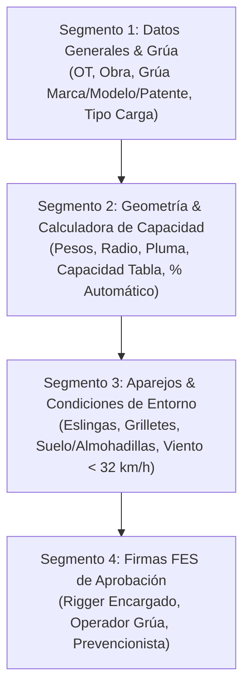

# 📋 Especificación Técnica N° 37: Plan de Izaje Digital & Calculadora Reactiva de Capacidad (GSP)

> **Estado:** ESPECIFICACIÓN TÉCNICA OFICIAL Y DISEÑO DE ARQUITECTURA  
> **Proyecto:** Grúas San Pablo (GSP) / Ecosistema LeanGlobal  
> **Ubicación:** `.agents/specs/37_plan_de_izaje_reactivo_spec.md`  
> **Código del Template:** `TMPL-GSP-PLAN-IZAJE`  
> **Nombre:** Plan de Izaje y Memoria de Cálculo de Maniobra  
> **Id Empresa:** 9 (Grúas San Pablo)  
> **Id Flujo (`id_flow_tmpl`):** 1 (FES_DIRECTA)  
> **Ámbito:** PWA Operador / Rigger ➔ Cálculo Matemático en Tiempo Real ➔ Compuerta de Seguridad 85% ➔ Aparejos ➔ Firmas FES ➔ PDF Oficial  

---

## 🎯 1. Propósito y Filosofía Operacional

El **Plan de Izaje Digital** formaliza la memoria técnica de la maniobra antes de levantar la carga en faena. Transforma la planilla Excel estática en una herramienta interactiva móvil que:

1. **Calcula Automáticamente el Peso Bruto:** Suma el peso de la carga neta más todas las deducciones (gancho, cable, yugo, aparejos).
2. **Calcula el % de Capacidad de Trabajo:** Contrasta la carga total contra la capacidad de tabla de la grúa en el radio máximo de operación.
3. **Aplica la Regla de Seguridad Dura ($\le 85\%$):**
   * $\le 75\%$: 🟢 **Izaje Estándar Seguro**.
   * $75\% - 85\%$: 🟡 **Izaje con Precaución**.
   * $> 85\%$: 🔴 **Izaje Crítico Bloqueado** (No se permite firmar sin autorización explícita de Ingeniería / Prevención).
4. **Respalda Aparejos y Terreno:** Valida eslingas, grilletes, almohadillas en gatos estabilizadores y velocidad del viento ($< 32\text{ km/h}$).

---

## 📐 2. Algoritmo Matemático y Lógica Reactiva

$$\text{Peso Total de Carga (kg)} = P_{\text{neto}} + P_{\text{gancho}} + P_{\text{yugo}} + P_{\text{aparejos}}$$

$$\% \text{ Capacidad de la Grúa} = \left( \frac{\text{Peso Total de Carga}}{\text{Capacidad de Tabla en Radio Máx}} \right) \times 100$$

### 🚥 Semáforo Reactivo de Capacidad:
| Rango de Utilización | Estado Operacional | Color UI | Acción del Sistema |
| :--- | :--- | :--- | :--- |
| **$0\% - 75.0\%$** | **Normal / Seguro** | 🟢 Verde | Maniobra estándar autorizada para firma. |
| **$75.1\% - 85.0\%$** | **Condición Límite** | 🟡 Amarillo | Advertencia en pantalla, requiere confirmación de Rigger. |
| **$> 85.0\%$** | **Izaje Crítico / Prohibido** | 🔴 Rojo | **Bloqueo mandatorio:** *"ESTE PLAN DE IZAJE NO PUEDE SER APROBADO: La capacidad supera el límite del 85%"*. |

---

## 🧱 3. Estructura de Segmentos



---

## 📄 4. Estructura JSON Canónica del Template (`tsrv_templates.json_template`)

```json
{
  "code": "TMPL-GSP-PLAN-IZAJE",
  "title": "PLAN DE IZAJE Y MEMORIA DE MANIOBRA",
  "description": "Cálculo técnico de capacidad, geometría de pluma, aparejos y compuerta de seguridad al 85%",
  "version": "1.0",
  "segments": [
    {
      "title": "1. DATOS GENERALES Y CLASIFICACIÓN DEL IZAJE",
      "posicion": 1,
      "collapsible": false,
      "attributes": [
        { "name": "num_ot", "label": "Código del Proyecto / N° OT", "type": "textField", "required": true },
        { "name": "fecha_plan", "label": "Fecha de la Maniobra", "type": "datePicker", "required": true },
        { "name": "hora_inicio", "label": "Hora Estimada de Inicio", "type": "textField", "required": true },
        { "name": "hora_termino", "label": "Hora Estimada de Término", "type": "textField", "required": true },
        { "name": "nombre_faena", "label": "Faena / Ubicación Exacta", "type": "textField", "required": true },
        { "name": "placa_patente_grua", "label": "Patente de la Grúa", "type": "textField", "required": true },
        { "name": "marca_modelo_grua", "label": "Marca y Modelo del Equipo", "type": "textField", "required": true },
        { "name": "nombre_rigger", "label": "Rigger / Encargado de Maniobra", "type": "textField", "required": true },
        { "name": "nombre_operador", "label": "Operador de Grúa", "type": "textField", "required": true },
        {
          "name": "tipo_carga",
          "label": "Tipo de Carga a Izar",
          "type": "comboBox",
          "default": "NEUTRA",
          "required": true,
          "values": {
            "quest": "Clasificación de Carga",
            "selected": "NEUTRA",
            "options": [
              { "id": "NEUTRA", "label": "Neutra (Estructuras, Bultos Generales)", "value": "NEUTRA" },
              { "id": "PELIGROSA", "label": "Peligrosa (Químicos, Estanques, Alta Complejidad)", "value": "PELIGROSA" },
              { "id": "IMPORTANTE", "label": "Importante / Alto Valor (Maquinaria Crítica)", "value": "IMPORTANTE" },
              { "id": "HUMANA", "label": "Carga Humana (Canastillo de Personal)", "value": "HUMANA" }
            ]
          }
        }
      ]
    },
    {
      "title": "2. GEOMETRÍA DE OPERACIÓN Y CÁLCULO DE CAPACIDAD",
      "posicion": 2,
      "collapsible": false,
      "attributes": [
        { "name": "peso_neto_carga_kg", "label": "1. Peso Neto a Izar (kg)", "type": "decimal", "default": "", "required": true },
        { "name": "radio_max_operacion_m", "label": "2. Radio Máximo de Operación (metros)", "type": "decimal", "default": "", "required": true },
        { "name": "largo_max_pluma_m", "label": "3. Largo de Pluma Requerido (metros)", "type": "decimal", "default": "", "required": true },
        { "name": "capacidad_radio_tabla_kg", "label": "4. Capacidad de Izaje según Tabla en Radio Máx (kg)", "type": "decimal", "default": "", "required": true },
        { "name": "peso_gancho_cable_kg", "label": "5. Peso Gancho y Cable (kg)", "type": "decimal", "default": "500", "required": true },
        { "name": "peso_aparejos_kg", "label": "6. Peso de Elementos de Estrobado (kg)", "type": "decimal", "default": "100", "required": true },
        { "name": "peso_yugo_kg", "label": "7. Peso del Yugo / Separador (kg) (0 si no aplica)", "type": "decimal", "default": "0", "required": true },
        { "name": "peso_total_carga_calculado", "label": "8. Peso Total Bruto de la Carga (kg) [Calculado: 1+5+6+7]", "type": "textField", "required": true },
        { "name": "porcentaje_capacidad_grua", "label": "9. % Utilización de Grúa [Calculado: (Peso Total / Capacidad Tabla) x 100]", "type": "textField", "required": true },
        {
          "name": "evaluacion_capacidad_85",
          "label": "Compuerta de Aprobación (Máximo 85%)",
          "type": "comboBox",
          "default": "",
          "required": true,
          "values": {
            "quest": "Estado de Utilización",
            "selected": "",
            "options": [
              { "id": "APROBADO_MENOR_85", "label": "🟢 CONFORME - Utilización ≤ 85%", "value": "APROBADO_MENOR_85" },
              { "id": "RECHAZADO_MAYOR_85", "label": "🔴 BLOQUEADO - Utilización > 85% (Prohibido Izar)", "value": "RECHAZADO_MAYOR_85" }
            ]
          }
        }
      ]
    },
    {
      "title": "3. APAREJOS DE LEVANTE Y CONDICIONES DE TERRENO",
      "posicion": 3,
      "collapsible": false,
      "attributes": [
        {
          "name": "check_estrobo_acero",
          "label": "Estrobos de Acero (Tipo, Diámetro, Capacidad y Factor Seg. 5:1)",
          "type": "photoCheck",
          "default": "",
          "hasCantidad": true,
          "unit": "unid",
          "options": [{ "id": "CONFORME", "label": "CONFORME" }, { "id": "NO_APLICA", "label": "N/A" }, { "id": "DANADO", "label": "DAÑADO" }]
        },
        {
          "name": "check_eslingas_sinteticas",
          "label": "Eslingas Sintéticas (Etiqueta visible, Capacidad y Factor Seg. 7:1)",
          "type": "photoCheck",
          "default": "",
          "hasCantidad": true,
          "unit": "unid",
          "options": [{ "id": "CONFORME", "label": "CONFORME" }, { "id": "NO_APLICA", "label": "N/A" }, { "id": "DANADO", "label": "DAÑADO" }]
        },
        {
          "name": "check_grilletes",
          "label": "Grilletes y Pasadores (Capacidad grabada, rosca en buen estado)",
          "type": "photoCheck",
          "default": "",
          "hasCantidad": true,
          "unit": "unid",
          "options": [{ "id": "CONFORME", "label": "CONFORME" }, { "id": "NO_APLICA", "label": "N/A" }, { "id": "DANADO", "label": "DAÑADO" }]
        },
        {
          "name": "condicion_suelo_soporte",
          "label": "Suelo y Estabilidad: ¿Terreno adecuado y uso obligatorio de almohadillas en platos?",
          "type": "comboBox",
          "default": "SI",
          "required": true,
          "values": {
            "quest": "Suelo Apto para Soporte",
            "selected": "SI",
            "options": [
              { "id": "SI", "label": "SÍ - Terreno Compacto y Nivelado con Almohadillas", "value": "SI" },
              { "id": "NO", "label": "NO - Terreno Blando / Inestable (Detener)", "value": "NO" }
            ]
          }
        },
        {
          "name": "condiciones_climaticas_ok",
          "label": "Clima: ¿Viento < 32 km/h, visibilidad adecuada y sin lluvia torrencial?",
          "type": "comboBox",
          "default": "SI",
          "required": true,
          "values": {
            "quest": "Condiciones Ambientales Aptas",
            "selected": "SI",
            "options": [
              { "id": "SI", "label": "SÍ - Condiciones Ambientales Favorables", "value": "SI" },
              { "id": "NO", "label": "NO - Viento > 32 km/h o Lluvia Extrema", "value": "NO" }
            ]
          }
        },
        { "name": "obs_maniobra", "label": "Observaciones Generales de la Maniobra", "type": "textField", "required": false }
      ]
    },
    {
      "title": "4. VALIDACIÓN FORMAL Y FIRMAS FES",
      "posicion": 4,
      "collapsible": false,
      "attributes": [
        { "name": "firma_rigger", "label": "Firma Digital Rigger / Encargado de Maniobras", "type": "signatureCapture", "required": true },
        { "name": "firma_operador", "label": "Firma Digital Operador de Grúa", "type": "signatureCapture", "required": true },
        { "name": "firma_prevencion", "label": "Firma Digital Prevención de Riesgos / Supervisor", "type": "signatureCapture", "required": false }
      ]
    }
  ]
}
```

---

## 🗃️ 5. Script de Seeding SQL (`tsrv_templates`)

Archivo preparado en: `ejecucion/bd/seed_plan_de_izaje_gsp.sql`
* **Id Empresa:** 9 (Grúas San Pablo)
* **Id Flujo:** 1 (FES Directa)
