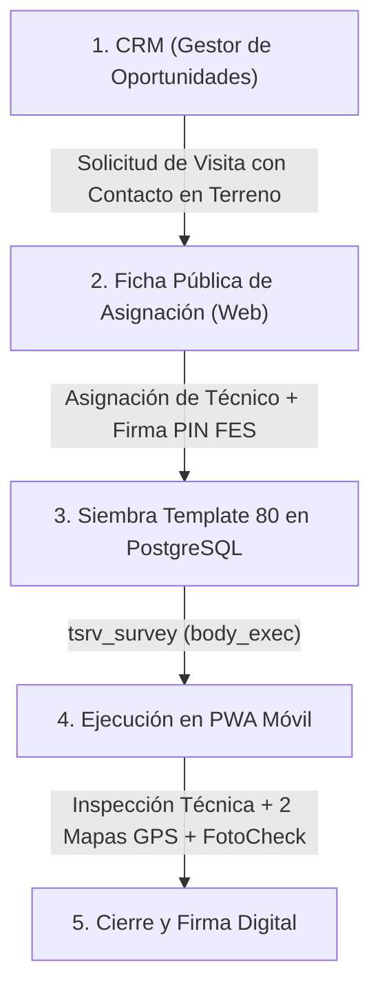

# 📋 Especificación Técnica Oficial: Módulo de Visita a Terreno (Site Visit GSP)

## 📌 1. Arquitectura y Flujo del Proceso

El flujo de **Visita a Terreno** cubre el ciclo de vida completo desde la prospección comercial en el CRM hasta la ejecución técnica en faena mediante la PWA:

---

## 🏢 2. Plataforma Web CRM (`GestorOportunidades.vue`)

### 2.1 Tarjeta "Flujo Asignación de Visita"
Campos obligatorios requeridos al comercial al solicitar una visita:
1. **Contacto en Terreno (Nombre):** Persona responsable que recibirá al técnico en la obra (`contacto_visita`).
2. **N° Teléfono Contacto:** Teléfono directo de contacto (`telefono_contacto_visita`).
3. **Correo Electrónico Contacto:** Email de contacto (`correo_contacto_visita`).
4. **Fecha y Turno Propuesto:** Fecha y ventana horaria de la visita.
5. **Observaciones:** Notas operativas preliminares.

### 2.2 Persistencia y Despacho
* **Persistencia:** Guardado en `tpry_proyecto.json_field.crm_v1.siteVisit` y base de datos.
* **Notificación B2B:** Correo automático al Coordinador de Operaciones con la ficha del proyecto y los datos de contacto.

---

## ✍️ 3. Ficha Pública de Asignación (`AsignacionVisita.vue`)

* **Visualización de Contacto:** El Coordinador revisa la información de la obra y el Contacto en Terreno, Teléfono y Correo.
* **Selección del Técnico:** Asigna al operador/técnico que ejecutará la inspección en terreno.
* **Firma FES:** Firma electrónica simple mediante PIN de 4 dígitos.
* **Siembra Automática:** Al confirmar la asignación, el backend siembra automáticamente:
  * `CONTACTO EN TERRENO`
  * `N° TELEFONO`
  * `CORREO ELECTRONICO`
  dentro de `body_exec` del Template 80 de la encuesta.

---

## 📱 4. Encuesta de Terreno PWA (Template 80 - 8 Segmentos)

La encuesta elimina redundancias comerciales y se compone de **8 segmentos técnicos**:

### Segmento 1: Datos Generales del Servicio
* **Nombre de la Obra:** Texto solo lectura (`SYSTEM`).
* **Dirección de la Obra:** Texto solo lectura (`SYSTEM`).
* **Contacto en Terreno:** Texto precargado desde CRM (`SYSTEM`).
* **N° Teléfono:** Teléfono de contacto precargado (`SYSTEM`).
* **Correo Electrónico:** Correo de contacto precargado (`SYSTEM`).

### Segmento 2: Geolocalización y Rutas (`geoLocation`)
* **Mapa 1 (Ubicación de la Obra):** Mapa de destino fijo centrado en las coordenadas georreferenciadas de la obra.
* **Botones de Navegación Externa:**
  * `🗺️ Navegar con Google Maps`
  * `🚙 Navegar con Waze`
* **Botón de Captura GPS:** `📍 Registro Geolocalización Visita`.
* **Mapa 2 (Ubicación Actual del Técnico):** Al pulsar el botón de captura, se obtiene la posición GPS en tiempo real del técnico y se renderiza un segundo mapa interactivo con marcador verde, círculo de precisión, hora y coordenadas exactas.
* **Persistencia Determinística:** Se almacena en `attr.geoVisita` y `attr.default.geoVisita` dentro de `body_exec`, permitiendo su recarga inmediata al reabrir el formulario y su estampado en el Visor Web (`verSurveyPrint.vue`).

### Segmento 3: Datos Específicos del Servicio
* **Equipo a Definir:** Combo / Texto (`comboBox`).
* **El Servicio Requiere Rigger:** Selección única (`radioButton` - SI / NO).

### Segmento 4: Datos Técnicos de la Ruta
Preguntas evaluadas bajo el formato **`photoCheck`**:
* Ruta Visita a Terreno (Desde / Hasta).
* Existencia de Romanas en el Trayecto.
* Cuestas Pronunciadas.
* Asfalto (SI/NO + Km).
* Ripio (SI/NO + Km).
* Puentes de Madera a Considerar (Cantidad, Dimensiones, Material de Vigas).
* Ramas de Árboles en la Ruta.
* Cables de Tendido Eléctrico Bajo.
* Camino Forestal.
* Obra en Macrozona Sur / Zona Roja.
* Condiciones de Superficie de Acceso.
* Recomendación de Mejoramiento / Refuerzo.

### Segmento 5: Datos Técnicos del Espacio de Trabajo
Preguntas evaluadas bajo el formato **`photoCheck`**:
* Espacio de Trabajo Suficiente.
* Condiciones del Terreno Favorables.
* Tipo de Suelo (Natural, Asfalto, Hormigón, Base Estabilizada, Otro).
* Tuberías Subterráneas en Zona de Apoyo.
* Bases Estabilizadoras Estándar Adecuadas.
* Tendido Eléctrico en Radio de Maniobra.
* Iluminación Suficiente.
* Interferencias de Árboles / Visibilidad.
* Condición Climática Condicionante.

### Segmento 6: Datos Técnicos de Izaje
* Tipo de Carga, Peso, Dimensiones (Largo x Ancho x Alto).
* Radios de Trabajo (Mínimo, Máximo, Altura).
* Puntos y Tomas de Izaje (Estado, Dimensiones para Grilletes, Maniobra Tándem).

### Segmento 7: Datos de Implementos para el Servicio
* Estrobos, Pulpos de Cadena, Eslingas, Grilletes y Accesorios especiales.

### Segmento 8: Recomendación y Firmas
* Observaciones y Recomendaciones Generales.
* **Firma del Técnico GSP:** Canvas de firma limpia (sin campos redundantes de RUT/Nombre).
* **Firma del Cliente Receptor:** Canvas de firma limpia.

---

## 🎨 5. Estándares UI de Componentes PWA

### 5.1 Componente `FotoCheck.vue`
* **Enunciado 100% Ancho:** El texto de la pregunta ocupa todo el ancho superior.
* **Fila Única de Acciones:** En una sola línea horizontal compacta:
  * Botón `SI` / `NO`.
  * Botón de Cámara 📷 con badge numérico indicador de fotos adjuntas.
  * Botón de Comentario 💬.
* **Comentario Bajo Demanda:** El campo de texto está oculto por defecto y solo se despliega si el usuario pulsa el botón de comentario o si ya contiene texto.
* **Almacenamiento:** Subida directa al tenant oficial `gsp`.

### 5.2 Componente `GeoLocation.vue`
* **Jerarquía:** Mapa de Obra (Destino) ➔ Botones Waze/Google Maps ➔ Botón Captura GPS ➔ Mapa de Técnico en Terreno (GPS en vivo).

### 5.3 Indicador de Avance y Micro-barra por Segmento
* **Icono Izquierdo Consistente:** `mdi-check-circle` (#10b981) al completar el 100% de las respuestas; `mdi-checkbox-blank-circle-outline` (#64748b) mientras esté en progreso.
* **Badge Numérico Cuantitativo:** Muestra `$X / $N` (preguntas completadas / preguntas totales válidas del segmento).
* **Micro-barra Horizontal (3px):** Delgada línea de progreso en la base inferior del encabezado del acordeón:
  * **En progreso:** Color azul cielo (`#38bdf8`) proporcional al porcentaje ($X/N \times 100\%$).
  * **Completado:** Color verde esmeralda (`#10b981`) al 100%.
