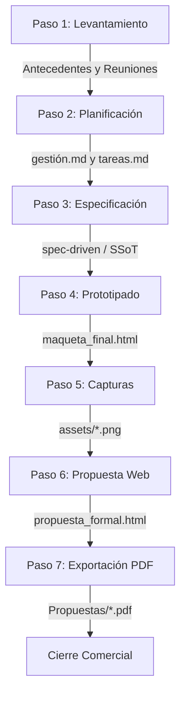

# 📖 Framework LeanGlobal: Modelo para la Preparación de Propuestas B2B (Receta)

Este framework define el estándar oficial de **LeanGlobal** para estructurar, maquetar, documentar y generar propuestas técnico-comerciales B2B de alto impacto para clientes industriales. La metodología combina **especificaciones técnicas rigurosas (Spec-Driven)**, **prototipado web interactivo de alta fidelidad** y **automatización de exportación a PDF**.

---

## 📁 1. Estructura de Directorios del Modelo

Para clonar y preparar una nueva propuesta, se debe replicar la siguiente estructura de carpetas y archivos en la raíz del espacio de trabajo:

```text
├── .agents/
│   └── skills/
│       └── generacion_propuesta_formal/
│           └── SKILL.md                 # Instrucciones del sistema para agentes de IA
├── .antigravity/
│   └── prompts/
│       ├── AGENTE-FRONTEND.md          # Directrices de UX/UI y diseño del mockup
│       ├── ESTANDAR_PROPUESTA_FORMAL.md# Directrices estructurales de la propuesta PDF
│       ├── context/
│       │   ├── architecture.md         # Arquitectura cloud y base de datos propuesta
│       │   └── business_rules.md       # Reglas de negocio e integraciones (ej: ERP)
│       └── spec-driven/
│           ├── 01_database_spec.md     # Estructura del esquema de BD literal
│           ├── 02_backend_spec.md      # Catálogo completo de endpoints de API
│           ├── 03_frontend_spec.md     # Controladores y rutas generales de interfaz
│           ├── METODOLOGIA_SPEC_DRIVEN.md # Reglas de consistencia (Verdad Única - SSoT)
│           └── [modulo]_spec.md        # Especificaciones granulares por módulo
├── antecedentes_reuniones/
│   ├── antecedentes/
│   │   ├── Descripción[Cliente].md     # Operación, flota, sucursales y dolores del cliente
│   │   └── Referencia[Concepto].md     # Definiciones contables/operacionales críticas
│   └── reuniones/
│       └── [YYYY-MM-DD]_minuta.md      # Actas de alineación comercial y técnica
├── Gestión/
│   ├── gestión.md                      # Hitos, cronograma y mitigación de riesgos
│   └── tareas.md                       # Kanban/Checklist de tareas de preventa
├── front/
│   ├── assets/                         # Imágenes dinámicas y capturas del prototipo
│   ├── maqueta_[Cliente]_v2.html       # Prototipo interactivo en crudo
│   ├── maqueta_[Cliente]_final.html    # Prototipo con CDN inyectados y datos dinámicos
│   ├── propuesta_formal.html           # Documento de propuesta interactivo (11 Secciones)
│   ├── server.js                       # Servidor local Express/Node para pruebas
│   ├── capturar_pantallas.mjs          # Script Puppeteer para capturar mockups
│   └── generar_pdf.mjs                 # Script Puppeteer para exportar a PDF horizontal
└── Propuestas/
    ├── Propuesta Técnico-Comercial_[Cliente].pdf             # PDF base
    └── Propuesta Técnico-Comercial_[Cliente]_CRM_[Fecha].pdf # PDF versionado
```

---

## ⚙️ 2. Flujo de Trabajo en 7 Pasos (La Receta)



### Paso 1: Levantamiento de Información (`antecedentes_reuniones/`)
*   Se recopila el contexto del cliente (sedes, flota, volumen transaccional) y se registra en `Descripción[Cliente].md`.
*   Cada reunión comercial se documenta con fecha, asistentes, compromisos y plazos en `reuniones/[Fecha]_minuta.md`.

### Paso 2: Planificación General (`Gestión/`)
*   Se redactan los objetivos de negocio del cliente y el cronograma del proyecto en `gestión.md`.
*   Se desglosan las tareas en `tareas.md` marcándolas con `[x]` para control visual.

### Paso 3: Planos Técnicos y Spec-Driven (`.antigravity/prompts/`)
*   Se redacta el modelo de datos en base al cual operará el sistema en `spec-driven/01_database_spec.md`.
*   Se especifican los campos y flujos sin omitir detalles ni usar placeholders (`...`).
*   Se definen las reglas en `METODOLOGIA_SPEC_DRIVEN.md`.

### Paso 4: Prototipado en Alta Fidelidad (`front/`)
*   Se desarrolla la maqueta interactiva local.
*   **Estética:** Se implementa la paleta corporativa y acentos de seguridad utilizando CSS nativo.
*   **Interactividad:** Gráficos (Highcharts), Mapas (Leaflet), Kanban funcional y modales interactivos para simular un producto real y funcional ante el cliente.

### Paso 5: Automatización de Capturas (`capturar_pantallas.mjs`)
*   Se ejecuta un script Puppeteer que simula la interacción del usuario con el prototipo (abre modales, cambia de tabs, cambia de rol).
*   Captura capturas limpias y recortadas (ej: del modal `.modal-content` o del frame del celular `.mobile-frame`) y las almacena automáticamente en `assets/`.

### Paso 6: Generación de la Propuesta Formal (`propuesta_formal.html`)
*   Se estructura la propuesta de 11 secciones combinando texto comercial persuasivo con las capturas generadas y tablas económicas detalladas.
*   Debe contener obligatoriamente el botón "Exportar a PDF" que invoca a la impresión del sistema.

### Paso 7: Exportación a PDF de Calidad Editorial (`generar_pdf.mjs`)
*   Se ejecuta el compilador Puppeteer en orientación horizontal con fondos habilitados.
*   Genera de forma limpia y desatendida el PDF en la carpeta `Propuestas/` listo para envío.

---

## 🎨 3. Estándar de Estilos e Impresión para Propuestas

La propuesta formal requiere estilos CSS que luzcan premium en pantalla y se adapten perfectamente a una hoja física o PDF. 

### Variables CSS Recomendadas (ADN Visual Slate/Amber)
```css
:root {
  --bg-main: #f8fafc;
  --bg-card: #ffffff;
  --bg-sidebar: #0f172a;
  
  --text-dark: #0f172a;
  --text-gray: #475569;
  --text-light: #94a3b8;
  
  --amber: #d97706;        /* Color acento - Amarillo Seguridad */
  --amber-light: #fef3c7;
  --blue: #2563eb;
  --green: #16a34a;
  --red: #dc2626;
  --border-color: #e2e8f0;
}
```

### Configuración CSS para Impresión Editorial PDF (`@media print`)
Este bloque CSS garantiza que el menú lateral se oculte, el fondo sea blanco, y no se corten tablas ni tarjetas a la mitad de una página:
```css
@media print {
  body {
    background: #ffffff !important;
    color: #000000 !important;
    font-size: 12px;
  }

  #app {
    box-shadow: none;
    max-width: 100%;
  }

  .sidebar, .print-btn {
    display: none !important; /* Oculta controles de navegación */
  }

  .content-wrapper {
    padding: 0 !important;
    overflow: visible !important;
  }

  section {
    page-break-before: always !important; /* Salto de página para cada sección */
    break-before: page !important;
    margin-bottom: 40px !important;
    padding-bottom: 20px !important;
  }

  .cover-page {
    page-break-after: always !important;
    break-after: page !important;
    min-height: 100vh !important;
  }

  .card, table, tr, .screenshot-figure, .callout {
    page-break-inside: avoid !important; /* Evita que se corten a la mitad */
    break-inside: avoid !important;
  }

  h1, h2, h3, h4, h5, h6 {
    page-break-after: avoid !important;
    break-after: avoid !important;
  }

  * {
    -webkit-print-color-adjust: exact !important; /* Preserva colores e imágenes de fondo */
    print-color-adjust: exact !important;
  }
}
```

---

## 🤖 4. Plantillas de Scripts de Automatización (Node.js)

### Plantilla `capturar_pantallas.mjs`
Este script levanta la maqueta y toma capturas limpias simulando la navegación.

```javascript
import puppeteer from 'puppeteer';
import fs from 'fs';
import path from 'path';
import { fileURLToPath } from 'url';

const __filename = fileURLToPath(import.meta.url);
const __dirname = path.dirname(__filename);

(async () => {
  const assetsDir = path.join(__dirname, 'assets');
  if (!fs.existsSync(assetsDir)) fs.mkdirSync(assetsDir, { recursive: true });

  console.log('Iniciando Puppeteer para capturas...');
  const browser = await puppeteer.launch({ headless: 'new', args: ['--no-sandbox'] });
  const page = await browser.newPage();
  await page.setViewport({ width: 1440, height: 900 });

  const absolutePath = path.resolve(__dirname, 'maqueta_[Cliente]_final.html').replace(/\\/g, '/');
  await page.goto(`file:///${absolutePath}`, { waitUntil: 'networkidle2' });
  await new Promise(resolve => setTimeout(resolve, 3000)); // Esperar render de gráficos

  // Captura 1: Vista General
  await page.screenshot({ path: path.join(assetsDir, 'kpi_dashboard.png') });

  // Captura 2: Simular clic en pestaña y capturar modal recortado
  await page.evaluate(() => {
    window.openModal('#SRV-001');
  });
  await new Promise(resolve => setTimeout(resolve, 1500));
  const modalEl = await page.$('.modal-content');
  if (modalEl) {
    await modalEl.screenshot({ path: path.join(assetsDir, 'modal_detalle.png') });
  }

  console.log('Capturas tomadas con éxito.');
  await browser.close();
})().catch(console.error);
```

### Plantilla `generar_pdf.mjs`
Este script compila el documento formal de HTML a PDF. Cuenta con control de reintentos por si el PDF original está bloqueado (abierto por el usuario).

```javascript
import puppeteer from 'puppeteer';
import path from 'path';
import fs from 'fs';
import { fileURLToPath } from 'url';

const __filename = fileURLToPath(import.meta.url);
const __dirname = path.dirname(__filename);

(async () => {
  console.log('Iniciando compilador de PDF...');
  const browser = await puppeteer.launch({ headless: 'new', args: ['--no-sandbox'] });
  const page = await browser.newPage();
  await page.setViewport({ width: 1440, height: 900, deviceScaleFactor: 2 });

  const htmlPath = path.resolve(__dirname, 'propuesta_formal.html').replace(/\\/g, '/');
  await page.goto(`file:///${htmlPath}`, { waitUntil: 'networkidle2' });
  await new Promise(resolve => setTimeout(resolve, 3000));

  const fechaHoy = new Date().toISOString().split('T')[0].replace(/-/g, '');
  const pdfOutput = path.resolve(__dirname, `../Propuestas/Propuesta_Comercial_[Cliente]_${fechaHoy}.pdf`);

  // Asegurar directorio
  const proposalsDir = path.dirname(pdfOutput);
  if (!fs.existsSync(proposalsDir)) fs.mkdirSync(proposalsDir, { recursive: true });

  console.log(`Compilando PDF en: ${pdfOutput}`);
  await page.pdf({
    path: pdfOutput,
    format: 'letter',
    landscape: true,
    printBackground: true,
    margin: { top: '0px', bottom: '0px', left: '0px', right: '0px' }
  });

  console.log('¡PDF Compilado con éxito!');
  await browser.close();
})().catch(console.error);
```

---

## 📌 5. Checklist de Verificación para Agentes de Programación

Cuando una IA asista en la edición de propuestas bajo este modelo, debe verificar:
1.  **Doble Entrada:** Todo cambio en la estructura de datos o precios en la cotización debe actualizarse tanto en las especificaciones (`.antigravity/prompts/spec-driven/`) como en el documento HTML (`front/propuesta_formal.html`).
2.  **Generación Post-Modificación:** Al alterar textos o tablas en el HTML de la propuesta, es obligatorio ejecutar `node generar_pdf.mjs` para regenerar la versión impresa distribuible.
3.  **Hojas de Estilo Inline:** Evitar CSS dependiente de servidores externos para elementos de maquetación (como fuentes de iconos propietarias); priorizar SVG en línea o utilidades de Lucide inyectadas localmente para permitir compilaciones offline robustas.
