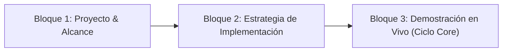
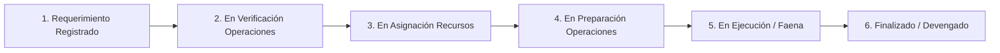

# 📋 Minuta y Dossier Ejecutivo: Presentación Primer Hito GSP
**Cliente:** Grúas San Pablo (GSP)  
**Audiencia Principal:** Omar Reyes (Fundador & Propietario GSP)  
**Participantes:** Sergio Gajardo (LeanGlobal), Jorge Ponce (GSP), Equipo Comercial y Operaciones  
**Fecha de Sesión:** Jueves 27 de Agosto de 2026  
**Ubicación:** `reuniones/ReuniónPrimerHito/2026-08-27_Presentacion_Primer_Hito_Omar_Reyes.md`

---

## 🎯 1. Propósito y Enfoque Estratégico

El objetivo de esta sesión es presentar a la máxima autoridad de Grúas San Pablo (**Omar Reyes**) el estado de avance, la arquitectura operativa y la demostración tangible de la plataforma digital integral desarrollada para blindar y digitalizar la operación de la empresa.

### Principios Rectores de la Presentación:
1. **Enfoque de Negocio & Control de Fugas:** Demostrar cómo el sistema elimina las pérdidas de ingresos típicas en faenas de izaje (horas no cobradas, desvíos de combustible, diferencias de cotización vs terreno, y pérdidas de aparejos).
2. **Alineación con la Realidad Operativa (Kanban de Torre de Control):** Explicar el flujo a través de las 6 columnas reales de la plataforma.
3. **Visibilidad de Entregables Tangibles:** Mostrar los documentos, encuestas técnicas, correos corporativos y firmas electrónicas que reemplazan el uso del papel.
4. **Demostración Práctica en Vivo:** Recorrido en tiempo real desde la llamada comercial hasta el arribo de la grúa a faena.

---

## 🏗️ 2. Estructura General de la Presentación (3 Bloques)

### 🔹 Bloque 1: Proyecto y Alcance (Visión Global)
* Diagnóstico de la problemática tradicional en grúas (desconexión ventas vs terreno, reportes en papel, disputas de horas con mandantes).
* Presentación del **Pipeline Operativo End-to-End** que interconecta Comercial, Operaciones, Choferes, Operadores y Mandantes.

### 🔹 Bloque 2: Estrategia de Implementación (Plan de Adopción Gradual)
* **Fase A (Activa / Parametrizada):** Maestros de flota, operadores, riggers y clientes cargados. CRM comercial y Torre de Control activos.
* **Fase B (Marcha Blanca / En Despliegue):** App móvil del conductor/operador, telemetría GPS en ruta, rendición Copec y reportes diarios con firma digital en terreno.
* **Fase C (Consolidación):** Manifiesto inverso de aparejos, WMS-Lite (repuestos) y conciliación automática de Estados de Pago (EDP) con Laudus ERP.

### 🔹 Bloque 3: Demostración en Vivo del Ciclo Core (12 - 15 minutos)
* Recorrido en vivo sobre la plataforma real con datos de Grúas San Pablo.

---

## 🗂️ 3. El Eje Operativo: Las 6 Estaciones del Kanban (`Torre.vue`)

---

### 1️⃣ Columna 1: Requerimiento Registrado (Preventa Comercial & Visita a Terreno)
* **Objetivo:** Capturar la necesidad del mandante, levantar condiciones técnicas en obra y emitir una cotización formal blindada en minutos.
* **Flujo Operativo:**
  1. El ejecutivo comercial registra la oportunidad en el CRM (cliente, contacto, obra y tipo de servicio).
  2. Si la faena requiere evaluación técnica, se activa la **Solicitud de Visita a Terreno**. El Coordinador asigna un técnico mediante enlace web seguro (`AsignacionVisita.vue`).
  3. El técnico asiste a terreno con la PWA/Web y completa el **Survey de Terreno (Template 80)**.
  4. Los datos de terreno alimentan el estructurador comercial con reglas automáticas (flete mandatorio, rigger obligatorio, pensiones y combustible).
  5. Se emite la cotización en PDF y, al ser ganada, se presiona *"Generar Requerimiento a Operaciones"*.
* **Artefactos y Elementos Tangibles:**
  * 🗺️ **Ficha Georreferenciada de Obra:** Coordenadas GPS satelitales, radios y alturas de trabajo.
  * 📋 **Survey de Visita a Terreno (Template 80):** Evaluación técnica con *photoChecks* (SÍ/NO + fotos obligatorias + comentarios) de suelo, pendientes, accesos para camas bajas, líneas de alta tensión y firma digital del cliente en terreno.
  * 📄 **Cotización Oficial en PDF:** Maquetación B2B con logo corporativo (GSP, Royal Rental, etc.), desglose de líneas, horas mínimas garantizadas y control de versiones (`[CODI]V1-105.pdf`).
  * 📧 **Correo Electrónico de Despacho:** Envío automático desde `notificaciones.gsp@leanglobal.cl` con trazabilidad de entrega y copias automáticas a gerencia/operaciones.

---

### 2️⃣ Columna 2: En Verificación Operaciones (Validación Técnica & Comparador Diff)
* **Objetivo:** Operaciones audita la propuesta comercial contrastándola con el levantamiento técnico de terreno, garantizando que el equipo dimensionado sea el adecuado.
* **Flujo Operativo:**
  1. El requerimiento ingresa automáticamente a la bandeja de operaciones con badge de prioridad (🔥 Alta).
  2. El coordinador revisa los datos de la Visita a Terreno (Pestaña A) y valida la grúa sugerida.
  3. Si se realizan ajustes técnicos (ej: cambiar grúa de 50T a 70T o añadir contrapesos), el sistema activa el **Comparador Diff (Comercial vs Operaciones)** para auditar desviaciones.
  4. El coordinador aprueba formalmente el requerimiento mediante el botón *"Aprobar Requerimiento & Habilitar Asignación OT"*.
* **Artefactos y Elementos Tangibles:**
  * 📥 **Bandeja de Entrada Operativa:** Visualización del requerimiento en la Torre de Control.
  * 🔄 **Comparador Visual Diff:** Resaltado cromático (rojo/amarillo) de cualquier discrepancia entre lo cotizado por ventas y lo ajustado por operaciones (KPI de precisión comercial).
  * 🛡️ **Compuerta de Aprobación Formal:** Bloqueo inmutable de antecedentes para pasar a la etapa de asignación.

---

### 3️⃣ Columna 3: En Asignación Recursos (Generación de Orden de Trabajo OT)
* **Objetivo:** Reservar y comprometer los recursos físicos (flota), humanos (tripulación) y aparejos necesarios para la maniobra.
* **Flujo Operativo:**
  1. El coordinador abre el DataGrid de alta densidad y selecciona la grúa principal y equipos de soporte disponibles.
  2. Asigna la tripulación certificada: Conductor/Operador y Rigger (filtrados por cargo en base de datos).
  3. Selecciona los aparejos e implementos de izaje necesarios (eslingas, grilletes, balancines).
  4. Confirma la asignación, bloqueando los recursos y generando la **Orden de Trabajo (OT)**.
* **Artefactos y Elementos Tangibles:**
  * 📊 **DataGrid Operacional de Alta Densidad:** Asignación visual compacta y simultánea de Grúa + Camión Pluma + Conductor + Rigger + Aparejos.
  * 📑 **Orden de Trabajo (OT) Oficial:** Código maestro único que consolida los datos de obra, tripulación asignada, implementos y ruta autorizada.

---

### 4️⃣ Columna 4: En Preparación Operaciones (Acreditaciones & Auditoría de Patio)
* **Objetivo:** Garantizar que la grúa y el personal ingresen a faena sin ser rechazados en portería y auditar la máquina antes del despacho.
* **Flujo Operativo:**
  1. El sistema evalúa el estado de los documentos requeridos mediante el **Dossier de Acreditaciones 360°**.
  2. El semáforo muestra alertas de vigencia (< 30 días) y calcula el **Micro-Gauge circular de % de acreditación**.
  3. Se despacha el expediente de acreditación consolidado al mandante por correo electrónico.
  4. En patio, se ejecuta la inspección mecánica 360° y trincaje vial.
  5. El chofer recibe su enlace móvil (`/viaje/:token`), registra odómetro/horómetro de salida y firma con su PIN de 4 dígitos.
* **Artefactos y Elementos Tangibles:**
  * 🚦 **Dossier & Semáforo de Acreditaciones 360°:** Matriz en 3 columnas (Empresa, Flota y Personal) con estado de certificados, licencias y revisiones técnicas.
  * 📤 **Visor y Despachador de Dossier:** Historial de correos enviados al mandante con visor HTML y links de descarga seguros.
  * 🛠️ **Checklist de Patio & Trincaje:** Verificación de luces, frenos, neumáticos, fugas y sujeción de contrapesos.
  * 🔒 **Web Token de Salida (`/viaje/:token`):** Pantalla móvil para validación de odómetro, horómetro y firma con PIN cifrado (SHA-256).

---

### 5️⃣ Columna 5: En Ejecución / Faena (Telemetría GPS, Copec & Maniobra)
* **Objetivo:** Monitorear el convoy en carretera en tiempo real, auditar cargas de combustible y certificar la faena con firma digital del cliente.
* **Flujo Operativo:**
  1. Durante el desplazamiento, el dispositivo del chofer emite pings telemétricos cada 10 segundos al servidor central.
  2. Si requiere combustible, el chofer solicita habilitación de tarjeta Copec en ruta, indicando estanque y adjuntando foto del voucher.
  3. Al llegar a faena, el chofer registra el odómetro final y sella la llegada con PIN, generando el **Log Maestro de Desplazamiento**.
  4. Durante la faena, el operador registra horas de izaje y, al concluir, el supervisor del cliente firma el **Reporte Diario de Operación** en pantalla táctil.
* **Artefactos y Elementos Tangibles:**
  * 🛰️ **Consola de Telemetría GPS en Vivo:** Indicador en ruta que transmite posición, rumbo y velocidad real.
  * ⛽ **Módulo de Rendición de Combustible Copec:** Selección de estanque (Chasis vs Grúa), registro de litros y foto del voucher.
  * 🏁 **Log Maestro de Desplazamiento:** Registro inalterable con tiempos de viaje, kilómetros recorridos, horas motor y mapa del trayecto.
  * ✍️ **Reporte Diario de Faena con Firma FES:** Formulario digital con horas efectivas de izaje, horómetros, fotos de maniobra y firma digital del cliente en terreno.

---

### 6️⃣ Columna 6: Finalizado / Devengado (Retorno, Manifiesto Inverso & EDP)
* **Objetivo:** Recepcionar los equipos en patio, controlar mermas de aparejos y emitir el cobro de inmediato sin desfase de fin de mes.
* **Flujo Operativo:**
  1. Al retornar la grúa a la base, se realiza el **Manifiesto Inverso de Aparejos** para verificar que no se hayan extraviado eslingas ni grilletes en faena.
  2. El Reporte Diario firmado se envía automáticamente al mandante y se archiva con sello de tiempo.
  3. El sistema consolida horas mínimas, horas extra, fletes y combustible en el **Estado de Pago (EDP)** para facturación directa en Laudus ERP.
* **Artefactos y Elementos Tangibles:**
  * 📦 **Checklist de Manifiesto Inverso:** Control de recepción de aparejos en bodega (cero pérdidas).
  * 📨 **Despacho Automático del Reporte Firmado:** Correo al mandante con el PDF legalmente respaldado.
  * 📊 **Dashboard de Devengado & Estado de Pago (EDP):** Reporte financiero consolidado listo para facturar.

---

## 🎬 4. Guion de la Demostración en Vivo (Paso a Paso)

| Minuto | Etapa / Pantalla | Acción en Vivo ante Omar Reyes |
|:---|:---|:---|
| **00 - 03** | **1. CRM Comercial** | Crear una cotización real en `GestorOportunidades.vue`: Seleccionar cliente, fijar obra en el mapa interactivo, seleccionar Grúa 50T, mostrar la inyección automática del Flete ($500.000), la exigencia de Rigger, el desglose de pensiones y generar el **PDF oficial** con 1 clic. |
| **03 - 05** | **2. Visita a Terreno** | Mostrar el Survey técnico (Template 80) con photoChecks de terreno y la firma digital levantada en terreno. |
| **05 - 08** | **3. Torre de Control & Asignación** | Abrir la Torre de Control (`Torre.vue`), mostrar el requerimiento, la aprobación con Diff y asignar la Grúa Tadano + Conductor + Rigger en el DataGrid con el **Semáforo de Acreditaciones** al 100%. |
| **08 - 11** | **4. App Móvil Conductor (Salida & Ruta)** | Abrir la vista móvil del chofer (`/viaje/:token`), ingresar odómetro inicial (145.000), horómetro (3.200) y PIN (`1234`) ➔ Mostrar el convoy en ruta y los **pings GPS transmitiendo en vivo cada 10s**. |
| **11 - 13** | **5. Carga Copec & Arribo a Faena** | Simular solicitud de combustible Copec y confirmar llegada a faena con odómetro final (145.120) y PIN ➔ Desplegar el **Log Maestro inalterable**. |
| **13 - 15** | **6. Reporte Diario & EDP** | Mostrar la pantalla de Reporte Diario con firma FES del cliente y el consolidado para facturación inmediata. |

---

## 📌 5. Próximos Pasos y Compromisos Post-Reunión

1. **Recoger Feedback Directo de Omar:** Validar ajustes en reglas de negocio o reportes ejecutivos.
2. **Definir Fecha de Inicio de Marcha Blanca Integral:** Habilitar el uso mandatorio del CRM y la App de Viajes para toda la flota activa.
3. **Plan de Capacitación Presencial:** Cronograma de talleres prácticos para conductores, operadores y coordinadores.
