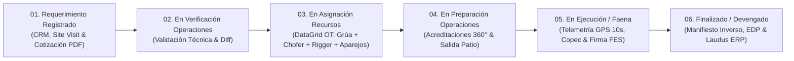

# 🏗️ Dossier Ejecutivo: Primer Hito de Plataforma Operativa GSP
**Cliente:** Grúas San Pablo (GSP)  
**Audiencia Principal:** Omar Reyes (Fundador & Propietario) y Equipo Directivo  
**Fecha de Sesión:** Jueves 27 de Agosto de 2026  
**Objetivo:** Demostración en vivo del Pipeline Operativo BPM de 6 Etapas (1:1 con la Torre de Control Kanban) y validación del cierre de brechas operacionales.

---

## 🎯 Resumen Ejecutivo

La plataforma **GSP Operaciones (LeanGlobal Platform)** ha completado su primer gran hito de desarrollo, conectando en un único flujo digital e ininterrumpido toda la dinámica comercial, operativa y logística de la compañía:

1. **Eliminación de Fugas de Ingresos:** Cotizaciones con reglas paramétricas duras (Rigger obligatorio por tonelaje, fletes georreferenciados, viáticos y pernoctaciones) y control formal de versiones.
2. **Validación Técnica Temprana:** Comparador Visual Diff entre lo comercial y la ingeniería operativa para evitar enviar grúas subdimensionadas o con tonelajes erróneos a faena.
3. **Control y Seguridad en Ruta:** Registro de odómetros/horómetros, monitoreo telemétrico GPS en tiempo real (pings cada 10s) y rendición remota de combustible Copec multi-estanque con foto del voucher.
4. **Cero Disputas de Cobro y Cero Papel:** Reporte Diario digital con firma digital FES del mandante en terreno y emisión automática de Estados de Pago (EDP) respaldados para facturación en Laudus ERP.

---

## 📐 El Pipeline de Procesos BPM (1:1 con la Torre Kanban)

---

## 📋 Detalle de las 6 Etapas y sus Entregables Tangibles

### 1. Requerimiento Registrado (Preventa Comercial & Visita a Terreno)
* **Objetivo Operativo:** Capturar la oportunidad comercial, levantar las restricciones de faena en terreno si la maniobra lo exige y emitir cotizaciones blindadas con trazabilidad.
* **Artefactos Entregables:**
  * **Survey Visita a Terreno (Template 80):** photoChecks con evidencia fotográfica obligatoria (tipo de suelo, pendientes, accesos para camión cama baja, líneas de alta tensión, radios de giro) y firma digital del cliente en terreno.
  * **Cotización PDF Oficial & Reglas Paramétricas:** Cálculo automatizado de fletes por georreferenciación, regla de Rigger obligatorio según tonelaje, matriz de viáticos y pernoctación, control de versiones `[CODIGO]V1.pdf` y tracking de despacho.
* **Aseguramiento de Calidad Comercial:** Garantiza que todo requerimiento derivado a Operaciones cuente con su cotización formal despachada, horas mínimas pactadas y condiciones de faena levantadas.

---

### 2. En Verificación Operaciones (Validación Técnica & Diff)
* **Objetivo Operativo:** El Coordinador de Operaciones recibe el requerimiento, consulta el informe técnico levantado en terreno y valida la factibilidad de la grúa antes de comprometerla físicamente.
* **Artefactos Entregables:**
  * **Comparador Visual Diff (Comercial vs Operaciones):** Si operaciones ajusta el tonelaje de la grúa (ej: 50T a 70T por radio de trabajo) o añade contrapesos, el sistema resalta las diferencias en amarillo/rojo para retroalimentar la precisión de ventas.
  * **Compuerta de Validación Técnica:** Bloqueo de antecedentes validados en modo solo lectura para resguardar la ingeniería de izaje antes de la asignación de recursos.
* **Validación y Factibilidad Operativa:** Asegura que cada maniobra cuente con la grúa y accesorios óptimos para operar bajo los más altos estándares de seguridad y productividad.

---

### 3. En Asignación Recursos (Generación de OT & Convoy)
* **Objetivo Operativo:** Asignación física y humana mediante el DataGrid de alta densidad operacional para armar el convoy completo de izaje.
* **Artefactos Entregables:**
  * **DataGrid Operacional B2B de Alta Densidad:** Asignación simultánea de Grúa principal (Tadano ATF 50, Liebherr) + Camión Pluma + Conductor + Rigger certificado + Matriz de Aparejos (eslingas, grilletes, balancines).
  * **Orden de Trabajo (OT) Oficial:** Código maestro único que consolida los datos de obra, tripulación asignada, implementos de izaje autorizados y ruta de despacho.
* **Estándar de Dotación y Competencias:** Exige la asignación exclusiva de personal debidamente calificado y certificado según el rol requerido para la faena.

---

### 4. En Preparación Operaciones (Patio & Acreditaciones 360°)
* **Objetivo Operativo:** Gobernanza documental previa al ingreso a faena (cero rechazos en portería del mandante) y verificación de salida de los equipos desde patio.
* **Artefactos Entregables:**
  * **Dossier & Semáforo de Acreditaciones 360°:** Micro-Gauge circular de avance y semáforo de vigencias para Empresa, Flota y Personal, con despacho directo del dossier digital consolidado al mandante.
  * **Web Token de Salida Móvil con PIN (`/viaje/:token`):** El conductor registra odómetro inicial, horómetro de salida y confirma la salida de patio con su PIN de 4 dígitos (SHA-256).
* **Gobernanza de Seguridad y Cumplimiento:** Alerta temprana y bloqueo visual si algún documento crítico de la máquina o del personal se encuentra vencido.

---

### 5. En Ejecución / Faena (Ruta, Copec & Firma FES)
* **Objetivo Operativo:** Monitoreo telemétrico continuo durante el trayecto, rendición de combustible en ruta y certificación de horas de servicio con firma digital del mandante.
* **Artefactos Entregables:**
  * **Telemetría GPS en Vivo (Pings cada 10s):** Transmisión continua de velocidad real, coordenadas y tiempos de traslado, consolidado en el Log Maestro de Desplazamiento.
  * **Rendición Copec Multi-Estanque & Reporte Diario FES:** Autorización remota de combustible con foto del voucher y Reporte Diario de Faena firmado digitalmente en pantalla por el supervisor del cliente.
* **Trazabilidad Continua y Resiliencia Operativa:** La aplicación móvil funciona 100% Offline en zonas sin cobertura y sincroniza de forma automática al recuperar señal.

---

### 6. Finalizado / Devengado (Retorno, EDP & Laudus ERP)
* **Objetivo Operativo:** Cierre físico y contable: recepción de aparejos en bodega y generación inmediata del Estado de Pago (EDP) respaldado para facturación.
* **Artefactos Entregables:**
  * **Manifiesto Inverso de Aparejos:** Control de retorno e inspección de eslingas, grilletes y cadenas entregados en patio para asegurar cero mermas materiales en faena.
  * **Estado de Pago (EDP) & Integración Laudus ERP:** Consolidación automática de horas efectivas, fletes y combustible para emitir facturación respaldada sin objeciones por parte del mandante.
* **Aseguramiento del Devengado y Cobro Oportuno:** Permite facturar el servicio con respaldo digital inmediato, reduciendo drásticamente los ciclos de cobro.

---

## 🎬 Guion de la Demostración en Vivo (15 Minutos)

| Minuto | Estación / Pantalla | Acción en Vivo ante Omar Reyes y Directivos | Evidencia Tangible |
|---|---|---|---|
| **00 - 03 min** | **1. Requerimiento Registrado** `GestorOportunidades.vue` | Crear cotización en vivo: Seleccionar cliente, fijar obra en mapa satelital, seleccionar Grúa 50T, mostrar el cálculo paramétrico de fletes, regla de Rigger y generar PDF oficial con 1 clic. | **Cotización PDF Oficial** |
| **03 - 05 min** | **2. Visita a Terreno** `AsignacionVisita.vue / PWA` | Mostrar el Survey técnico (Template 80) con photoChecks de terreno y la firma digital levantada en terreno inyectada en la Ficha del Proyecto. | **Survey con photoChecks** |
| **05 - 08 min** | **3. En Asignación Recursos** `Torre.vue / Asignación` | Abrir la Torre de Control, mostrar el requerimiento, la aprobación con Diff y asignar la Grúa Tadano + Chofer + Rigger en el DataGrid con el Semáforo de Acreditaciones al 100%. | **DataGrid + Semáforo 360°** |
| **08 - 11 min** | **4. En Preparación Operaciones** `/viaje/:token (Salida Patio)` | Abrir la vista móvil del chofer, ingresar odómetro inicial (145.000), horómetro (3.200) y PIN (1234) ➔ Mostrar el convoy en ruta y los pings GPS transmitiendo en vivo cada 10s. | **Telemetría GPS en Vivo** |
| **11 - 13 min** | **5. En Ejecución / Faena** `Modal Copec & Cierre` | Simular solicitud de combustible Copec y confirmar llegada a faena con odómetro final (145.120) y PIN ➔ Desplegar el Log Maestro inalterable y Reporte Diario con firma FES. | **Log Maestro + Firma FES** |
| **13 - 15 min** | **6. Finalizado / Devengado** `Manifiesto & EDP` | Mostrar la recepción de aparejos en bodega (0 mermas) y el consolidado del Estado de Pago (EDP) listo para exportación y facturación en Laudus ERP. | **EDP + Devengado Inmediato** |

---

## 🚀 Estrategia de Implementación Gradual

* **Fase A (100% Completada):** Parametrización y Maestros (Flota, personal certificado, clientes y reglas tarifarias).
* **Fase B (Activa en Marcha Blanca):** CRM, Cotizador PDF y Torre de Control Kanban con despacho de viajes móviles.
* **Fase C (Próximo Despliegue):** Capacitación práctica a choferes (uso de PIN y vouchers) y adopción del Reporte Diario digital con clientes.
* **Fase D (Consolidación Financiera):** Integración con Laudus ERP para facturación automática de EDPs y control de bodega de aparejos.
