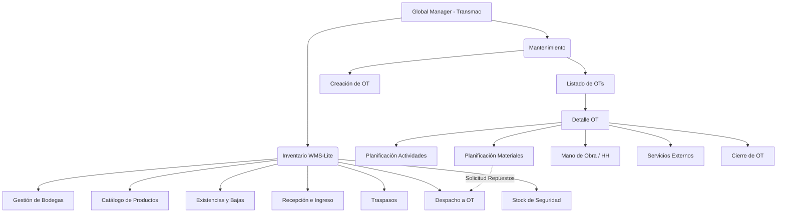
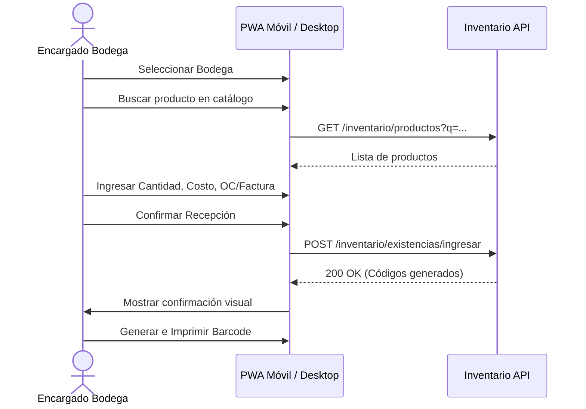
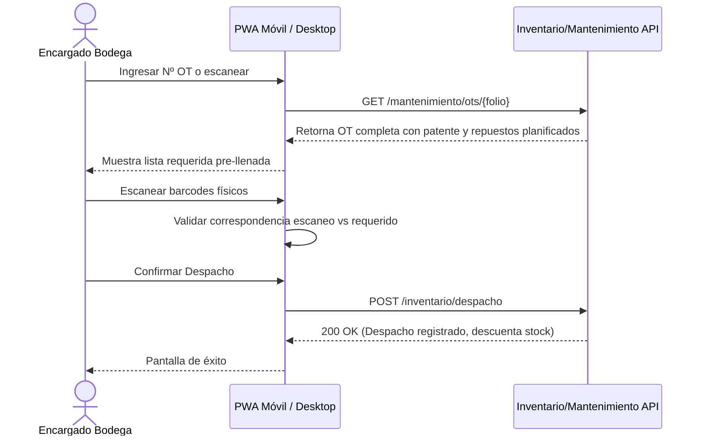
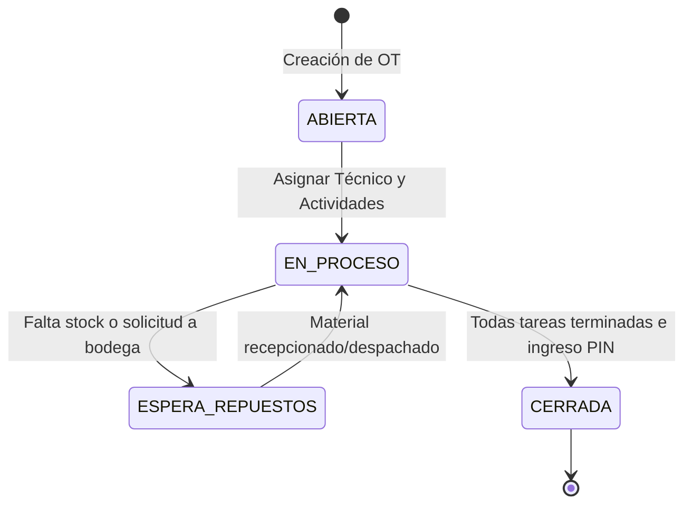
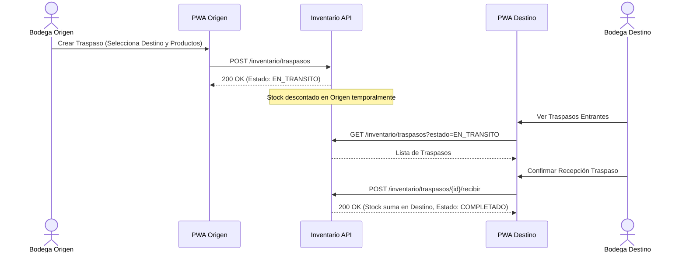

# Documentación Visual de Flujos y Navegación

## Estilo Visual (Guía Frontend)
- **Fondo General**: `#030712` (dark)
- **Tarjetas/Contenedores**: `bg-darkcard`
- **Acentos**:
  - Inventario (WMS-Lite): Indigo (`#6366f1`)
  - Mantenimiento: Emerald (`#10b981`)
- **Componentes**: Tablas con hover effect y paginación; formularios presentados en modales deslizantes (slide-over) o drawers.
- **Estados de OT (Semáforo)**:
  - `ABIERTA`: Azul
  - `EN_PROCESO`: Amarillo
  - `ESPERA_REPUESTOS`: Rojo
  - `CERRADA`: Verde

---

## 1. Mapa de Módulos



---

## 2. Flujo de Usuario: Recepción de Material



---

## 3. Flujo de Usuario: Despacho a OT



---

## 4. Flujo de Usuario: Ciclo Completo de OT



---

## 5. Flujo de Usuario: Traspaso Inter-Bodega



---

## 6. Tabla de Pantallas → Endpoints

| Pantalla | Rol | Dispositivo | Endpoints que consume |
|----------|-----|-------------|------------------------|
| **Gestión Bodegas** | `ADMIN_INVENTARIO` | Desktop | `GET /inventario/bodegas`, `POST /inventario/bodegas`, `PUT /inventario/bodegas/{id}` |
| **Catálogo Productos** | `ADMIN_INVENTARIO` | Desktop | `GET /inventario/productos`, `POST /inventario/productos`, `PUT /inventario/productos/{id}` |
| **Stock Seguridad** | `ADMIN_INVENTARIO` | Desktop | `GET /inventario/bodegas/{id}/stock-seguridad`, `POST /inventario/bodegas/{id}/stock-seguridad` |
| **Existencias y Bajas** | `ADMIN_INVENTARIO`, `ENCARGADO_BODEGA` | Desktop/PWA | `GET /inventario/existencias`, `POST /inventario/existencias/baja` |
| **Recepción Ingreso** | `ENCARGADO_BODEGA` | PWA / Desktop | `GET /inventario/productos`, `POST /inventario/existencias/ingresar` |
| **Despacho a OT** | `ENCARGADO_BODEGA` | PWA | `GET /mantenimiento/ots/{folio}`, `POST /inventario/despacho` |
| **Traspasos** | `ENCARGADO_BODEGA` | PWA / Desktop | `GET /inventario/traspasos`, `POST /inventario/traspasos`, `POST /inventario/traspasos/{id}/recibir` |
| **Listado OTs** | `JEFE_TALLER`, `SUPERVISOR`, `TECNICO` | Desktop/PWA | `GET /mantenimiento/ot` |
| **Creación OT** | `JEFE_TALLER`, `SUPERVISOR` | Desktop | `POST /mantenimiento/ot` |
| **Detalle OT** | `JEFE_TALLER`, `TECNICO` | Desktop/PWA | `GET /mantenimiento/ot/{id}`, `PUT /mantenimiento/ot/{id}` |
| **Planif. Actividades** | `JEFE_TALLER` | Desktop | `GET /mantenimiento/ot/{id}/actividades`, `POST /mantenimiento/ot/{id}/actividades` |
| **Planif. Materiales** | `JEFE_TALLER` | Desktop | `GET /mantenimiento/ot/{id}/materiales`, `POST /mantenimiento/ot/{id}/materiales` |
| **Mano de Obra / HH** | `TECNICO` | PWA | `GET /mantenimiento/ot/{id}/hh`, `POST /mantenimiento/ot/{id}/hh` |
| **Cierre OT** | `JEFE_TALLER` | Desktop | `POST /mantenimiento/ot/{id}/cierre` (Requiere PIN) |

---

## 7. Wireframes Textuales

### A. Recepción de Material (PWA / Modal Desktop)
```text
+-----------------------------------------------------------+
| [<-] Recepción de Materiales                       [ x ]  |
+-----------------------------------------------------------+
| Bodega: [ Selector: Bodega Principal ▼ ]                  |
|                                                           |
| +-------------------------------------------------------+ |
| | Búsqueda de Producto: [ 🔍 Escriba código o nombre..] | |
| +-------------------------------------------------------+ |
|                                                           |
| Producto Seleccionado:                                    |
| [ Filtro Aceite FL-400S ] [ Marca: Motorcraft ]           |
|                                                           |
| Ubicación Física:    [ Ej: Pasillo 3, Estante B ]         |
| Cantidad a Ingresar: [ 50 ] Unidades                      |
| Costo Adquisición:   [ $ 4.500 ] Neto                     |
|                                                           |
| Documentos Respaldo:                                      |
| [ Selector: Factura ▼ ] Nº Doc: [ 993821 ]                |
|                                                           |
| +-------------------------------------------------------+ |
| |                 [ INGRESAR STOCK ]                    | |
| +-------------------------------------------------------+ |
| * Acento de botón: bg-indigo-600                          |
+-----------------------------------------------------------+
```

### B. Detalle de OT - Vista Jefe de Taller (Desktop)
```text
+-----------------------------------------------------------------------------------+
|  OT #10045 - Mantenimiento Preventivo  |  Estado: [ EN_PROCESO ] (bg-yellow-500)  |
+-----------------------------------------------------------------------------------+
| Equipo/Patente: AB-CD-12          Supervisor: Juan Pérez                          |
| Falla: Revisión de frenos 10.000km                                                |
+-----------------------------------------------------------------------------------+
| [ Actividades ]  [ Materiales ]  [ Mano de Obra (HH) ]  [ Servicios Externos ]    |
+-----------------------------------------------------------------------------------+
|                                                                                   |
|  +-----------------------------------------------------------------------------+  |
|  | Tarea                       | Hrs Est. | Estado        | Acciones           |  |
|  +-----------------------------------------------------------------------------+  |
|  | 1. Desmontar ruedas         | 1.5      | [ Completada ]| [✏️] [🗑️]           |  |
|  | 2. Revisión pastillas       | 0.5      | [ En Proceso ]| [✏️] [🗑️]           |  |
|  | 3. Armado y prueba ruta     | 1.0      | [ Pendiente  ]| [✏️] [🗑️]           |  |
|  +-----------------------------------------------------------------------------+  |
|  [ + Agregar Tarea ]                                                              |
|                                                                                   |
+-----------------------------------------------------------------------------------+
|                                                     [ CIERRE DE OT (PIN) 🔒 ]     |
+-----------------------------------------------------------------------------------+
```
