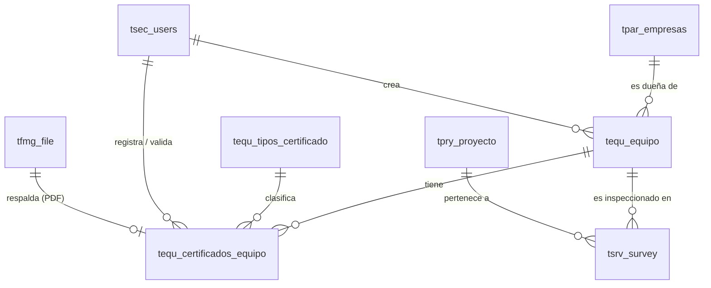

# Plan de Implementación: Modelado de Equipos y Certificados en PostgreSQL

Este documento presenta la propuesta de diseño y modelado de datos en la base de datos de PostgreSQL para soportar el módulo de **Equipos** y la gestión y control de sus **Certificados** vigentes.

El diseño se alinea con la nomenclatura, convenciones de nombres, tipos de datos y estructuras maestras identificadas en la base de datos actual, pero sin forzar ni prefijar un esquema de base de datos específico (`schema-agnostic`).

---

## Análisis y Contexto del Esquema Actual

Durante la investigación del esquema de base de datos actual, se identificaron las siguientes entidades clave que ya existen y que se relacionan directamente con el flujo de negocio:
- **`tpar_empresas`**: Registro de clientes y subcontratistas.
- **`tpry_proyecto`**: Registro de contratos y proyectos de faena.
- **`tsec_users`**: Registro de usuarios del sistema (operadores, supervisores, validadores).
- **`tfmg_file`**: Tabla de control y almacenamiento de archivos/documentos adjuntos.
- **`tsrv_survey`**: Registro de encuestas e inspecciones realizadas.
- **`tequ_equipo`**: Tabla base preliminar de equipos.
- **`tequ_documentacion_equipo`**: Tabla preliminar de acreditación (calibraciones).
- **`tsec_documentacion_persona`**: Estructura de documentos de personas (referencia de diseño útil para certificados).

---

## Modelo Entidad-Relación Propuesto

Para soportar la gestión dinámica de equipos y el control estricto de sus certificados (múltiples certificados por equipo, con vigencias, alarmas y archivos adjuntos), se propone la creación de dos nuevas tablas y la extensión de las tablas existentes:

1. **`tequ_tipos_certificado` [Nueva]**: Catálogo para normalizar los tipos de certificados (ej: Certificación de Grúa, Certificación de Gancho, Certificado de Estrobos, Revisión Técnica, SOAP).
2. **`tequ_certificados_equipo` [Nueva]**: Tabla para registrar el historial y la vigencia de los certificados de cada equipo, con enlace al archivo PDF original.
3. **`tequ_equipo` [Modificar/Extender]**: Añadir columnas para asociar cada equipo a una **Empresa** (`id_empresa`) y registrar datos técnicos de izaje (patente, código interno, capacidad de carga).
4. **`tsrv_survey` [Modificar/Extender]**: Añadir la columna `id_equipo` para vincular cada inspección o checklist directamente con el equipo inspeccionado.

### Diagrama Entidad-Relación (Mermaid)



---

## Proposed Changes (Scripts SQL DDL sin Esquema)

A continuación se detalla el script SQL necesario para actualizar la base de datos. Se han removido todas las referencias fijas de esquema para permitir que se ejecute en el esquema que esté por defecto en el `search_path` de la sesión.

### 1. Extensión de la Tabla de Equipos (`tequ_equipo`)
Aseguramos las relaciones y campos clave para la operación (patente, capacidad e identificación interna).

```sql
-- Agregar columnas adicionales a tequ_equipo
ALTER TABLE tequ_equipo
ADD COLUMN IF NOT EXISTS id_empresa integer REFERENCES tpar_empresas(id_empresa),
ADD COLUMN IF NOT EXISTS patente character varying(15),
ADD COLUMN IF NOT EXISTS codigo_interno character varying(50),
ADD COLUMN IF NOT EXISTS capacidad_maxima numeric(10,2),
ADD COLUMN IF NOT EXISTS unidad_capacidad character varying(10) DEFAULT 'TON',
ADD COLUMN IF NOT EXISTS ano_fabricacion integer,
ADD COLUMN IF NOT EXISTS updated_at timestamp without time zone DEFAULT CURRENT_TIMESTAMP;

-- Comentarios explicativos
COMMENT ON COLUMN tequ_equipo.id_empresa IS 'Empresa dueña o subcontratista dueña del equipo';
COMMENT ON COLUMN tequ_equipo.patente IS 'Patente del vehículo/maquinaria si aplica';
COMMENT ON COLUMN tequ_equipo.codigo_interno IS 'Código interno de identificación de la empresa (ej: GM-01, AL-04)';
COMMENT ON COLUMN tequ_equipo.capacidad_maxima IS 'Capacidad máxima de izaje o carga del equipo';
```

### 2. Creación del Catálogo de Tipos de Certificado (`tequ_tipos_certificado`)
Permite clasificar y parametrizar las reglas de obligatoriedad y alertas.

```sql
CREATE TABLE IF NOT EXISTS tequ_tipos_certificado (
    id_tipo_certificado SERIAL PRIMARY KEY,
    nombre_tipo character varying(150) NOT NULL UNIQUE,
    descripcion text,
    obligatorio boolean DEFAULT true,
    dias_alerta_vencimiento integer DEFAULT 30,
    estado character varying(10) DEFAULT 'Activo', -- 'Activo', 'Inactivo'
    created_at timestamp without time zone DEFAULT CURRENT_TIMESTAMP
);

COMMENT ON TABLE tequ_tipos_certificado IS 'Maestro de tipos de certificados que deben cumplir los equipos';
```

### 3. Creación de la Tabla de Certificados del Equipo (`tequ_certificados_equipo`)
Registra cada documento físico, su vigencia temporal y su validez aprobada.

```sql
CREATE TABLE IF NOT EXISTS tequ_certificados_equipo (
    id_certificado SERIAL PRIMARY KEY,
    id_equipo integer NOT NULL REFERENCES tequ_equipo(id_equipo) ON DELETE CASCADE,
    id_tipo_certificado integer NOT NULL REFERENCES tequ_tipos_certificado(id_tipo_certificado),
    entidad_emisora character varying(150),
    numero_certificado character varying(100),
    fecha_emision date NOT NULL,
    fecha_vencimiento date NOT NULL,
    id_doc integer REFERENCES tfmg_file(id_doc), -- Archivo PDF/Imagen
    estado_validacion character varying(20) DEFAULT 'PENDIENTE', -- 'PENDIENTE', 'APROBADO', 'RECHAZADO'
    observaciones text,
    id_usuario_valida integer REFERENCES tsec_users(id_user),
    fecha_validacion timestamp without time zone,
    id_usuario_creacion integer REFERENCES tsec_users(id_user),
    created_at timestamp without time zone DEFAULT CURRENT_TIMESTAMP,
    updated_at timestamp without time zone DEFAULT CURRENT_TIMESTAMP,
    CONSTRAINT chk_fechas_certificado CHECK (fecha_vencimiento >= fecha_emision)
);

CREATE INDEX IF NOT EXISTS idx_tequ_cert_equipo ON tequ_certificados_equipo(id_equipo);
CREATE INDEX IF NOT EXISTS idx_tequ_cert_vencimiento ON tequ_certificados_equipo(fecha_vencimiento);

COMMENT ON TABLE tequ_certificados_equipo IS 'Historial y registro vigente de certificados cargados para cada equipo';
```

### 4. Vínculo de Inspecciones con Equipos (`tsrv_survey`)
Permite asociar de forma directa y estructurada una inspección a un equipo.

```sql
-- Agregar id_equipo a la tabla de encuestas/inspecciones
ALTER TABLE tsrv_survey
ADD COLUMN IF NOT EXISTS id_equipo integer REFERENCES tequ_equipo(id_equipo);

COMMENT ON COLUMN tsrv_survey.id_equipo IS 'Equipo asociado a la inspección/checklist realizado';
```

### 5. Categorización, Marcas y Modelos de Equipos
Tablas añadidas para normalizar las clasificaciones operacionales y de preventa.

```sql
-- Creación del catálogo de Categorías y Subcategorías
CREATE TABLE IF NOT EXISTS tequ_categoria (
    id_categoria SERIAL PRIMARY KEY,
    id_empresa integer DEFAULT 0,
    nombre_categoria character varying(100) NOT NULL,
    estado character varying(10) DEFAULT 'Activo',
    created_at timestamp without time zone DEFAULT CURRENT_TIMESTAMP,
    CONSTRAINT uq_categoria_empresa UNIQUE (id_empresa, nombre_categoria)
);

CREATE TABLE IF NOT EXISTS tequ_subcategoria (
    id_subcategoria SERIAL PRIMARY KEY,
    id_categoria integer NOT NULL REFERENCES tequ_categoria(id_categoria) ON DELETE CASCADE,
    nombre_subcategoria character varying(100) NOT NULL,
    estado character varying(10) DEFAULT 'Activo',
    created_at timestamp without time zone DEFAULT CURRENT_TIMESTAMP,
    CONSTRAINT uq_subcategoria_categoria UNIQUE (id_categoria, nombre_subcategoria)
);

-- Creación del catálogo de Marcas y Modelos
CREATE TABLE IF NOT EXISTS tequ_marca (
    id_marca SERIAL PRIMARY KEY,
    nombre_marca character varying(100) NOT NULL UNIQUE,
    estado character varying(10) DEFAULT 'Activo',
    created_at timestamp without time zone DEFAULT CURRENT_TIMESTAMP
);

CREATE TABLE IF NOT EXISTS tequ_modelo (
    id_modelo SERIAL PRIMARY KEY,
    id_marca integer NOT NULL REFERENCES tequ_marca(id_marca) ON DELETE CASCADE,
    nombre_modelo character varying(100) NOT NULL,
    estado character varying(10) DEFAULT 'Activo',
    created_at timestamp without time zone DEFAULT CURRENT_TIMESTAMP,
    CONSTRAINT uq_modelo_marca UNIQUE (id_marca, nombre_modelo)
);

-- Extender tequ_equipo con llaves foráneas a subcategoría y modelo
ALTER TABLE tequ_equipo
ADD COLUMN IF NOT EXISTS id_subcategoria integer REFERENCES tequ_subcategoria(id_subcategoria),
ADD COLUMN IF NOT EXISTS id_modelo integer REFERENCES tequ_modelo(id_modelo);

-- Comentarios explicativos
COMMENT ON TABLE tequ_categoria IS 'Maestro de categorías de equipos por empresa (0 para global)';
COMMENT ON TABLE tequ_subcategoria IS 'Maestro de subcategorías dependientes de la categoría';
COMMENT ON TABLE tequ_marca IS 'Maestro de marcas de fabricantes de la flota';
COMMENT ON TABLE tequ_modelo IS 'Maestro de modelos de equipos de la flota por marca';
```

---

## Reglas de Negocio y Lógica de Validación Recomendada

Una vez implementado el modelo en PostgreSQL, se aconseja implementar las siguientes lógicas para sacarle provecho a nivel de plataforma:

1. **Validación de Vigencia Automática**:
   - Un certificado está **Vigente** si:
     - `estado_validacion = 'APROBADO'`
     - `fecha_vencimiento >= CURRENT_DATE`
   - Si no cumple estas condiciones, el sistema debe marcarlo como **No Vigente** o **Expirado**.

2. **Control en Inspecciones (Pre-Uso / Checklists)**:
   - Al seleccionar un equipo para realizar una encuesta `tsrv_survey`, el backend debe realizar una consulta simple para verificar si el equipo tiene todos los tipos de certificados marcados como `obligatorio = true` con estado **Vigente**.
   - En caso de tener certificados obligatorios vencidos o no cargados, la plataforma puede emitir una advertencia visible en la PWA o bloquear la ejecución del flujo de firmas si el equipo no está apto operacionalmente.

3. **Notificación Anticipada (Alertas)**:
   - Utilizando la tabla `tntf_notfqueue` existente y un script programado (cron job/job worker), se puede consultar diariamente aquellos certificados cuya `fecha_vencimiento` esté dentro del rango de `dias_alerta_vencimiento` definidos para su tipo, notificando por correo o sistema al supervisor asignado.

---

## Plan de Verificación

### Pruebas Automatizadas
1. **Ejecución del Script de Migración**:
   - Correr el script DDL propuesto en un entorno de desarrollo.
   - Verificar la creación exitosa de las tablas y columnas mediante consultas de metadatos (`information_schema.tables`).
2. **Prueba de Integridad Referencial**:
   - Insertar registros de prueba en `tequ_tipos_certificado` y `tequ_equipo`.
   - Probar la inserción exitosa de un certificado en `tequ_certificados_equipo` relacionando correctamente el equipo, el tipo de certificado, un usuario de creación y un archivo simulado.
   - Verificar que las restricciones `FOREIGN KEY` y el check de fechas funcionen (por ejemplo, intentar insertar una fecha de vencimiento menor a la de emisión debe fallar).

### Verificación Manual
1. Revisar que los tipos de datos se ajusten a los requeridos por la plataforma para números de serie, patentes y capacidades de carga.
2. Validar que la tabla propuesta permita almacenar un histórico de certificados cargados y mantener visibles los vigentes sin perder el registro de versiones anteriores vencidas.
