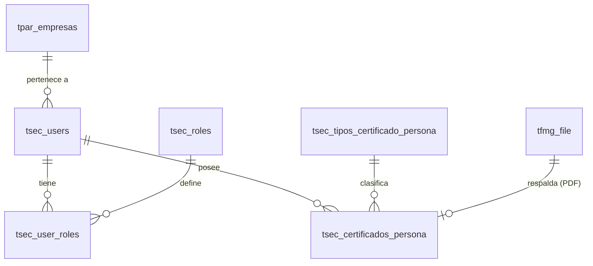

# Plan de Implementación: Modelado de Personal y Certificados en PostgreSQL

Este documento presenta la propuesta de diseño y modelado de datos en la base de datos de PostgreSQL para soportar el módulo de **Personal** (Trabajadores) y la gestión y control de sus **Certificados de Competencias, Salud y Legales**.

El diseño se alinea con la nomenclatura, convenciones de nombres, tipos de datos y estructuras maestras de Grúas San Pablo (GSP).

---

## Análisis y Contexto del Esquema Actual

Se identifican las siguientes entidades clave que ya existen y se relacionan directamente con el flujo de personal:
- **`tsec_users`**: Registro principal de usuarios (operadores, riggers, supervisores, comerciales, administradores).
- **`tsec_roles`**: Catálogo de roles de la plataforma.
- **`tsec_user_roles`**: Tabla intermedia que asocia usuarios con roles.
- **`tfmg_file`**: Tabla de control y almacenamiento de archivos/documentos adjuntos.

---

## Modelo Entidad-Relación Propuesto

Para soportar la gestión dinámica de los documentos de los trabajadores y el control estricto de su acreditación para ingresar a faena, se propone la creación de dos nuevas tablas:

1. **`tsec_tipos_certificado_persona` [Nueva]**: Catálogo para normalizar los tipos de documentos exigidos al personal (ej: Cédula de Identidad, Licencia de Conducir, Examen Ocupacional, Examen Psicotécnico PST, Credencial de Acreditación, Reglamento Interno).
2. **`tsec_certificados_persona` [Nueva]**: Tabla para registrar la vigencia e historial de documentos/certificados cargados por cada trabajador, con enlace al archivo PDF original.

### Diagrama Entidad-Relación (Mermaid)



---

## Scripts SQL DDL (Sin Esquema Fijo)

A continuación se detalla el script SQL necesario para actualizar la base de datos:

### 1. Creación del Catálogo de Tipos de Certificado de Personal (`tsec_tipos_certificado_persona`)
Permite clasificar y parametrizar las reglas de obligatoriedad y alertas.

```sql
CREATE TABLE IF NOT EXISTS tsec_tipos_certificado_persona (
    id_tipo_certificado_persona SERIAL PRIMARY KEY,
    nombre_tipo character varying(150) NOT NULL UNIQUE,
    descripcion text,
    obligatorio boolean DEFAULT true,
    dias_alerta_vencimiento integer DEFAULT 30,
    estado character varying(10) DEFAULT 'Activo', -- 'Activo', 'Inactivo'
    created_at timestamp without time zone DEFAULT CURRENT_TIMESTAMP
);

COMMENT ON TABLE tsec_tipos_certificado_persona IS 'Maestro de tipos de certificados exigidos al personal';
```

### 2. Creación de la Tabla de Certificados del Personal (`tsec_certificados_persona`)
Registra cada documento físico, su vigencia temporal y su validez aprobada.

```sql
CREATE TABLE IF NOT EXISTS tsec_certificados_persona (
    id_certificado_persona SERIAL PRIMARY KEY,
    id_user integer NOT NULL REFERENCES tsec_users(id_user) ON DELETE CASCADE,
    id_tipo_certificado_persona integer NOT NULL REFERENCES tsec_tipos_certificado_persona(id_tipo_certificado_persona),
    entidad_emisora character varying(150) DEFAULT 'GSP',
    numero_registro character varying(100),
    fecha_emision date,
    fecha_vencimiento date, -- NULL para documentos permanentes (ej: Reglamento Interno)
    id_doc integer REFERENCES tfmg_file(id_doc), -- Archivo PDF/Imagen en tfmg_file
    estado_validacion character varying(20) DEFAULT 'APROBADO', -- 'PENDIENTE', 'APROBADO', 'RECHAZADO'
    observaciones text,
    created_at timestamp without time zone DEFAULT CURRENT_TIMESTAMP,
    updated_at timestamp without time zone DEFAULT CURRENT_TIMESTAMP
);

CREATE INDEX IF NOT EXISTS idx_tsec_cert_persona_user ON tsec_certificados_persona(id_user);
CREATE INDEX IF NOT EXISTS idx_tsec_cert_persona_vencimiento ON tsec_certificados_persona(fecha_vencimiento);

COMMENT ON TABLE tsec_certificados_persona IS 'Historial y registro de vigencia de certificados cargados para cada trabajador';
```

---

## Criterios de Homologación e Importación

El script de importación masiva mapeará los archivos de la carpeta física de trabajadores bajo las siguientes reglas:

### 1. Mapeo de Nombres de Archivos a Tipos Maestros
Se creará un diccionario de correspondencia semántica para normalizar las cargas en la tabla `tsec_tipos_certificado_persona`:

| Prefijo de Archivo | Nombre de Tipo de Certificado Normalizado | Clasificación | Obligatorio |
|---|---|---|---|
| `Cedula identidad` | `Cédula de Identidad` | Legal | Sí |
| `Licencia conducir` | `Licencia de Conducir` | Legal | Sí |
| `Contrato` | `Contrato de Trabajo` | Laboral | Sí |
| `Ex. PST` / `Ex. PST.` | `Examen Psicotécnico PST` | Salud | Sí |
| `Ex. ocup.` / `Ex. Preocup.` | `Examen Ocupacional` | Salud | Sí |
| `Certificación` / `Certificaciòn` | `Certificación de Competencias` | Técnico / Izaje | Sí (para operadores) |
| `Credencial` | `Credencial de Operador/Rigger` | Técnico / Izaje | Sí (para operadores) |
| `IRL` | `Reglamento Interno (RIOHS)` | Seguridad | No |
| `Ind, RIOHS, EPP` | `Inducción y Entrega de EPP` | Seguridad | No |
| `ODI, PTS` | `Obligación de Informar (ODI) / PTS` | Seguridad | Sí |
| `Instructivos` | `Entrega de Instructivos` | Seguridad | No |
| `42 hrs.` | `Anexo Jornada Laboral (42 Hrs)` | Laboral | No |

### 2. Extracción de Vigencias (Sintáctica)
*   **Con vencimiento:** Si el nombre del archivo contiene una fecha (ej. `07-08-2025`), se extrae mediante expresión regular (`\d{2}-\d{2}-\d{4}`), se parsea a formato estándar `YYYY-MM-DD` (`2025-08-07`) y se guarda en `fecha_vencimiento`.
*   **Permanente:** Si el nombre no incluye fecha (ej. `IRL.pdf`), se inserta con `fecha_vencimiento = NULL`.

---

## Lógica de Validación y Semáforos en Consola

1.  **Semáforo de Acreditación Personal:**
    Un certificado de personal se clasifica visualmente en la Consola de Administración según su vencimiento:
    *   🔴 **Vencido (Error):** `fecha_vencimiento < CURRENT_DATE`
    *   🟡 **Por Vencer (Alerta):** `fecha_vencimiento <= CURRENT_DATE + dias_alerta_vencimiento` (normalmente 30 días).
    *   🟢 **Vigente (OK):** `fecha_vencimiento > CURRENT_DATE + dias_alerta_vencimiento`
    *   ⚪ **Permanente (OK):** `fecha_vencimiento IS NULL`
2.  **Validación de Operador en Torre de Control:**
    Al asignar tripulación a un proyecto, el sistema validará que el operador/rigger cuente con todos sus certificados marcados como `obligatorio = true` con estado **Vigente** o **Permanente**, bloqueando la asignación o mostrando una advertencia crítica en caso de documentos vencidos.
