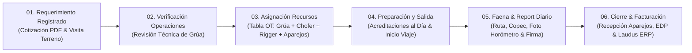

# 🏗️ Digitalización Integral de la Operación de Izaje
**Cliente:** Grúas San Pablo (GSP)  
**Audiencia:** Omar Reyes y el equipo administrativo, comercial y de operaciones de GSP  
**Fecha de Sesión:** Jueves 27 de Agosto de 2026  
**Objetivo:** Demostración práctica del flujo operativo en 6 pasos (conectado con la Torre de Control) y revisión de las herramientas digitales para el trabajo diario.

---

## 🎯 Principios Rectores y Resumen de la Presentación

La plataforma **GSP Operaciones** sustenta toda su dinámica en tres principios fundamentales:

1. 🛡️ **Calidad de la Información:** Datos operacionales confiables, validados y contrastados desde la cotización hasta el terreno.
2. ⏱️ **Oportunidad de la Información:** Información disponible en tiempo real para la toma de decisiones inmediata de todo el equipo.
3. 🔗 **Trazabilidad:** Seguimiento íntegro de cada servicio, equipo, personal, combustible y horas trabajadas.

### Pilares del Primer Hito:
* **Cotizaciones Claras y Rápidas:** Cálculo automático de fletes por distancia, selección de rigger según tonelaje, registro de viáticos y emisión de la cotización en PDF con control de versiones.
* **Revisión Técnica en Operaciones:** Comparador entre lo solicitado por ventas y lo revisado por operaciones para confirmar la grúa y accesorios óptimos para el trabajo.
* **Asignación Rápida de Recursos:** Tabla ágil para coordinar grúas, camiones de apoyo, conductores, riggers calificados y aparejos en la Orden de Trabajo (OT).
* **Preparación y Acreditaciones al Día:** Semáforo visual para verificar que la documentación de personas y máquinas esté vigente antes de salir a faena.
* **Control de Viaje y Report Diario en Terreno:** Registro de odómetros y horómetros en la app móvil, cargas de combustible Copec y Report Diario con foto del horómetro y firma en pantalla del cliente.
* **Cierre de Faena y Facturación Oportuna:** Resumen consolidado de horas normales y sobretiempo para emisión de Estados de Pago (EDP) y facturación ágil en Laudus ERP.

---

## 📐 Flujo Operativo en 6 Pasos

---

## 📋 Detalle de los 6 Pasos del Servicio

### 1. Requerimiento Registrado (Preventa Comercial & Visita a Terreno)
* **Objetivo:** Registrar la oportunidad comercial, levantar las condiciones de terreno si la maniobra es compleja y emitir la cotización formal en PDF.
* **Herramientas y Entregables:**
  * **Levantamiento de Visita a Terreno:** Registro con fotos de terreno (suelo, accesos para cama baja, cables eléctricos, radios de giro) y firma del cliente en obra.
  * **Cotización PDF Oficial:** Cálculo de fletes por distancia, asignación de Rigger por tonelaje, viáticos y pernoctación, y control de versiones `[CODIGO]V1.pdf`.
* **Control Comercial:** Asegura que todo servicio enviado a Operaciones cuente con su cotización formal, condiciones de faena claras y horas mínimas acordadas.

---

### 2. Verificación en Operaciones (Validación Técnica)
* **Objetivo:** El área de Operaciones revisa el requerimiento, consulta el informe de terreno y confirma la grúa y accesorios adecuados antes de asignarlos.
* **Herramientas y Entregables:**
  * **Comparador Comercial vs Operaciones:** Si Operaciones ajusta el modelo de grúa por radio de trabajo o agrega contrapesos, el sistema resalta las diferencias para mantener informada al área de ventas.
  * **Confirmación Técnica:** Aprobación formal de los requerimientos técnicos antes de pasar a la asignación de flota y personal.
* **Validación Operativa:** Asegura que cada maniobra cuente con la grúa, tonelaje y accesorios correctos para trabajar con total seguridad y eficiencia.

---

### 3. Asignación de Recursos (Generación de la OT)
* **Objetivo:** Asignación de equipos y personal calificado mediante una tabla ágil y compacta para armar la Orden de Trabajo (OT).
* **Herramientas y Entregables:**
  * **Tabla de Asignación Operativa:** Asignación simultánea de Grúa principal + Camión Pluma / Cama Baja + Conductor + Rigger calificado + Aparejos (eslingas, grilletes, balancines).
  * **Orden de Trabajo (OT) Oficial:** Documento maestro que reúne los datos de obra, equipo asignado, personal autorizado y ventana de fechas planificada.
* **Asignación Calificada:** Facilita asignar conductores, operadores y riggers con sus certificaciones al día.

---

### 4. Preparación y Salida de Patio (Acreditaciones & Salida)
* **Objetivo:** Revisión de acreditaciones para el ingreso a faena y registro de salida de los equipos desde patio.
* **Herramientas y Entregables:**
  * **Semáforo de Acreditaciones al Día:** Visualización rápida del estado de documentos de Empresa, Flota y Personal para enviar el dossier al cliente con anticipación.
  * **Inicio de Viaje en la App Móvil (`/viaje/:token`):** El conductor anota su odómetro y horómetro de salida e inicia el trayecto de forma sencilla con su PIN personal.
* **Cumplimiento y Seguridad:** Permite verificar anticipadamente que la documentación de equipos y personas esté al día para evitar demoras en portería.

---

### 5. Ejecución en Faena (Ruta, Combustible & Report Diario)
* **Objetivo:** Seguimiento del trayecto en ruta, registro de cargas de combustible y emisión del Report Diario con firma en pantalla del cliente y foto del horómetro.
* **Herramientas y Entregables:**
  * **Ubicación en Ruta y Tiempos de Traslado:** Registro de tiempos de viaje y llegada a obra para respaldo de traslados y fletes.
  * **Cargas Copec & Report Diario Firmado:** Registro de litros y boleta de combustible, más Report Diario con horarios, colación, horómetros, foto del tablero y firma del cliente en terreno.
* **Control en Terreno:** La aplicación móvil funciona incluso sin señal de internet y se actualiza automáticamente al recuperar cobertura.

---

### 6. Cierre y Facturación (Retorno, EDP & Laudus ERP)
* **Objetivo:** Cierre del servicio: revisión de aparejos al volver a patio y generación del resumen de horas y Estado de Pago (EDP) para facturación.
* **Herramientas y Entregables:**
  * **Recepción de Aparejos en Bodega:** Control de retorno de eslingas, grilletes y accesorios para mantener el inventario ordenado y prevenir pérdidas.
  * **Estado de Pago (EDP) e Integración ERP:** Consolidación automática de horas normales, sobretiempo y traslados pactados para facturación ágil en Laudus ERP.
* **Cierre y Cobro Oportuno:** Permite respaldar las horas efectivas trabajadas para una facturación clara y sin disputas.

---

## 🎬 Guion de la Demostración Práctica (15 Minutos)

| Tiempo | Estación / Pantalla | Paso Demostrativo | Resultado Tangible |
|---|---|---|---|
| **00 - 03 min** | **1. Requerimiento Registrado** `Gestor de Oportunidades` | Crear una cotización: seleccionar cliente, ubicar la faena en el mapa satelital, seleccionar grúa de 50T, verificar flete y rigger automático y generar la cotización PDF en 1 clic. | **Cotización PDF Oficial** |
| **03 - 05 min** | **2. Visita a Terreno** `Formulario Móvil / PWA` | Mostrar el levantamiento técnico con fotos de terreno (suelo, accesos, cables) y la firma del cliente capturada en obra incorporada en la ficha. | **Informe con Fotos de Terreno** |
| **05 - 08 min** | **3. Asignación de Recursos** `Torre de Control / OT` | Ingresar a la Torre de Control, revisar la validación técnica y armar el convoy (Grúa Tadano + Chofer + Rigger + Aparejos) con semáforos de acreditación al día. | **Tabla OT + Acreditaciones** |
| **08 - 11 min** | **4. Preparación y Salida** `App Móvil del Conductor` | Abrir la pantalla móvil del chofer, ingresar odómetro (145.000), horómetro (3.200) y PIN ➔ Iniciar viaje y ver la ubicación GPS actualizándose en ruta. | **Ubicación GPS en Ruta** |
| **11 - 13 min** | **5. Faena y Report Diario** `PWA Móvil del Operador` | Completar el Report Diario en faena: horarios, colación, horómetros, foto del tablero y firma táctil del supervisor mandante en terreno. | **Report Diario Firmado + Foto** |
| **13 - 15 min** | **6. Cierre y Facturación** `Estado de Pago / EDP` | Ver la aprobación del analista en la Torre de Control, el retorno de aparejos a bodega y el resumen consolidado de horas para facturación en Laudus ERP. | **Resumen EDP Listo para Cobro** |

---

## 🚀 Plan de Puesta en Marcha Gradual

* **Fase A (Completada):** Parametrización y Maestros (Flota, personal calificado, clientes y reglas tarifarias).
* **Fase B (Activa en Marcha Blanca):** CRM, Cotizador PDF y Torre de Control Kanban con despacho de viajes móviles.
* **Fase C (Próximo Despliegue):** Capacitación práctica a conductores y operadores (uso de PIN, vouchers de combustible y Report Diario digital con fotos).
* **Fase D (Consolidación):** Integración con Laudus ERP para facturación automática de EDPs y control de bodega de aparejos.
